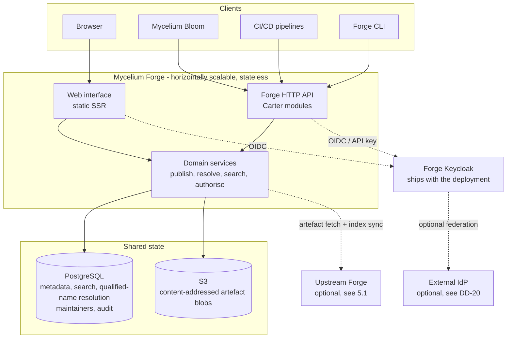
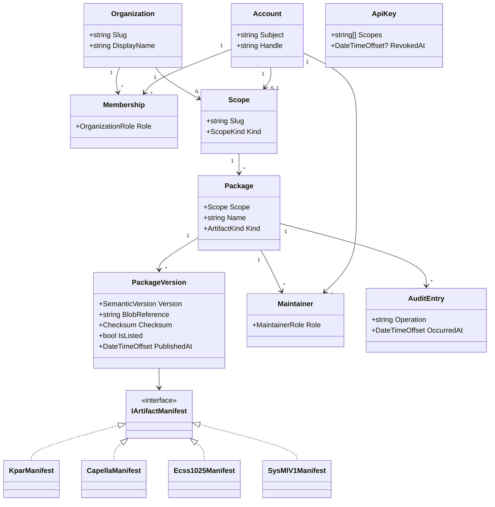

# Mycelium Forge — Software Design Document

**Status:** Draft, for PDR
**Applies to:** `mycelium-forge`
**Traces to:** Mycelium Software System Specification (SSS) §4.4, §5.2.3, §5.3, §5.13

---

## 1. Purpose

This document records the design of **Mycelium Forge**, the artefact registry of the Mycelium
ecosystem. It states the decisions taken, the reasoning behind them, and the questions still open.

The SSS is the authority on *what* Forge must do. This document is the authority on *how*. Where the
design deliberately exceeds or diverges from the SSS, that is called out explicitly in §3 rather than
left implicit — those points require a corrective update to the SSS.

---

## 2. Scope

Forge is the package registry for the Mycelium ecosystem, taking its design cues from nuget.org,
Maven Central and PyPI (SSS §5.2.3.1). It exposes **three surfaces over one backing store**:

| Surface | Consumers | Requirements |
|---|---|---|
| Public web interface | Humans, search engine crawlers | `SSS-FG-REG-W9J`, `X1K` |
| Forge HTTP API | Bloom, CI/CD, third-party tools | `SSS-FG-REG-A5E`, `D6F`, `Q7G`, `M8H`; `SSS-CC-EXT-FG1` |
| First-party client library | Bloom, CI/CD, third-party tools | `SSS-FG-REG-C3M` |

### 2.1 Competitive position

Forge is positioned against **sysand** (sensmetry/sysand), a package manager for SysML v2 and KerML.
It is open source and Rust-based, and its README states it is "based on a concept of a model
interchange project, a slight generalization of a project interchange file (`*.kpar`), defined in KerML
clause 10.3" — **the same foundation as Forge**. The two therefore differ by architecture and reach
rather than by underlying format.

| | sysand | Mycelium Forge |
|---|---|---|
| Topology | Official index at sysand.com, plus private indexes via `sysand index` | Central registry |
| Storage | Decoupled from the index; the project's own examples demonstrate storing kpars in GitHub Releases | The registry owns the blobs (§12) |
| Primary interface | CLI, plus Python and Java APIs and WASM bindings | Web discovery interface, plus CLI and .NET client |
| Formats | SysML v2 and KerML | Multi-format — additionally Capella and ECSS-E-TM-10-25 (§3.1) |

The architectural split is real: sysand's model resembles Go modules, where an index points at
artefacts hosted anywhere; Forge's resembles nuget.org, where the registry owns storage, metadata and
discovery. Neither is wrong. Federation comes more naturally to the former; ownership enforcement,
faceted discovery and integration with an identity provider come more naturally to the latter.

Forge's differentiators follow from that, and should drive prioritisation:

- **Multi-format storage** (§3.1). sysand covers SysML v2 and KerML; Capella and ECSS-E-TM-10-25 are
  Forge's ground.
- **The web discovery surface** (`SSS-FG-REG-W9J`, `X1K`). A decentralised index cannot offer faceted
  browsing over content it does not hold. §5.1.6 extends this to mirrors: an on-premise Forge searches
  the whole upstream catalogue, not merely what it has cached, which is more than a conventional
  repository proxy manages for any format except Maven.
- **Fabric and Bloom integration** with enterprise identity (`SSS-FG-AUTH-S1A`) and the ownership model
  (`SSS-FG-AUTH-M3C`) — where those products are present. Forge is deployable without them (§3.5,
  DD-20), so this is a differentiator in the Mycelium context rather than a dependency.

One observation worth carrying into planning rather than treating as a footnote: **sysand already ships
the client languages §11.3 lists as planned** — Python and Java APIs, plus WASM bindings covering the
JavaScript ecosystem. On breadth of language support Forge is catching up, not leading.

### 2.1 Explicitly out of scope

Forge is a registry, not a modelling environment. **No Mycelium Bloom capability belongs in Forge** —
no project browser, no model tree, no diagram editing, no concurrent-design session handling. Bloom
and Forge share a *design system* (BlazorBlueprint and the Figma component library), and nothing more.
The Figma source for both products lives in one file, so this boundary needs active defence during
implementation: a component being available in the shared library is not a reason for it to appear in
Forge.

---

## 3. Deliberate divergences from the SSS

These are intentional. Each needs a corresponding SSS amendment.

### 3.1 Forge stores more than kpar

`SSS-FG-REG-K1A` states Forge "shall accept and distribute every published SysML v2 library as a
single **kpar** file". The design instead treats kpar as **the first of several artefact formats**.
Capella and CDP4-COMET / ECSS-E-TM-10-25 are in scope as stored artefact kinds. SysML v1 is deferred:
its archive layout depends on the authoring tool, so there is no single format to target (§9.2).

This is a product decision, not an implementation convenience: the intent is for Forge to be the
registry for MBSE artefacts generally, not for SysML v2 libraries alone. The domain model is therefore
polymorphic from the first commit (§8), so that adding a format is an additive change rather than a
schema migration.

Corroborating evidence from the design: the search facet panel already groups results by **metamodel**
("SysML v2 (2025-02)", "KerML"), which is the natural axis along which further formats extend.

### 3.2 SemVer is mandatory in Forge, optional in KerML

KerML 1.0 §10.3 *Model Interchange Projects* (pp. 432–435) is permissive:

> "It is recommended, but not required, that *semantic versioning* (see https://semver.org/) be used
> for the version numbering of interchange projects"

`SSS-FG-REG-S2B` makes SemVer 2.0.0 **mandatory**, and adds a monotonicity constraint KerML does not
have. Forge policy is therefore stricter than the specification it builds on. This is recorded here so
that a future contributor does not "correct" the validator to match KerML.

### 3.3 Concepts present in the design but absent from the SSS

Identified from the Figma prototype and requiring requirements coverage:

- **A documentation site** — `Docs Home`, `Docs Concept`, `Docs Howto`, `Docs CLI`, `Docs HTTP API`,
  plus a `Copy-page` overlay. The SSS covers the registry UI, not a docs surface.
- **A Forge CLI** — implied by the `Docs CLI` page. `SSS-FG-REG-C3M` mandates a client *library*; a
  command-line tool built on it is an additional deliverable. **Confirmed in scope for the current
  contract** (§11.2), so this needs a requirement rather than remaining an inference from the design.
- **Client libraries in Java and TypeScript** (§11.3), likewise beyond `SSS-FG-REG-C3M`.
- **Upstream mirroring** (§5.1) — an on-premise instance proxying an upstream Forge while hosting local
  packages, with bulk pre-warm and air-gapped bundle seeding. SSS §4.4 describes on-premise
  single-tenant deployment but says nothing about proxying an upstream. **Confirmed in scope for the
  first release**, so it needs requirements coverage rather than resting on this design alone.
- **Verified-publisher badging** — visible on `@mycelium/ISQ-quantities-units`. No SSS requirement
  defines what verification means or who grants it. Confirmed as intended, **scoped to publisher
  identity only and deferred beyond the first release** (§13.1); it needs a requirement before it is
  built.
- **Two popularity metrics, not one.** The interface currently shows an "imports" count, while
  `SSS-FG-REG-X1K` requires "download counts". These measure genuinely different things and both are
  wanted:

  | | Measures | Source |
  |---|---|---|
  | **Downloads** | Artefact fetches. Inflated by CI pipelines, mirrors and tooling | Recorded events (DD-15) |
  | **Dependents** | How many packages in the registry build on this one | Derived from the `usage[]` graph (DD-19) |

  **The metric is renamed from "imports" to "dependents".** It does not count times a package was
  imported into a project — Forge never observes that — it counts *packages known to Forge whose
  latest listed version declares a dependency on this one*. "Imports" reads as the former, which is
  exactly the misreading this bullet warns against, and it is the reading a newcomer will take.
  nuget.org says "Used By", crates.io "Reverse dependencies", npm "Dependents".

  The naive inference — "many downloads, few dependents means automation rather than real use" —
  **does not hold and should not be presented**. A leaf library that modellers reference directly and
  never re-publish has no dependents by construction, however widely used it is. The two numbers
  distinguish a *building block* from an *end-user library*, not genuine use from automated use.

  *Action for the designer: surface both on the search result card and the package detail page,
  labelled distinctly enough that they are not read as the same number.*

### 3.4 Free-text search is scoped to package metadata

This is the one place the design deliberately delivers **less** than a requirement asks for, so the
reasoning is set out at length.

`SSS-FG-REG-Q7G` requires free-text query terms to be matched against "package identifier, display
name, description, tags, authors, **and the indexed content of the library (element names, qualified
names, Metadata Definitions, Quantity Kinds)**", with all of it feeding one ranked result set.

The design narrows this. **Free-text relevance search covers package metadata only.** Element content
is served instead by a separate, non-ranked capability — qualified-name resolution (§10.2) — which
answers "which package version defines this element?" by exact or prefix match.

#### Why blending content into relevance search defeats itself

A package containing an element named `Temperature` is not a package *about* temperature. Element
names are a very low-precision signal for package-level relevance, and the error is not random: it is
systematically biased toward the largest and most general libraries.

The ISQ quantities library contains essentially every physical quantity name in existence. Under
content matching it would match nearly any physics-adjacent query and surface in almost every result
set — and it is a package Forge is *required* to host (`SSS-PA-IE-OYJ`). The packages that match most
are therefore the least useful answer to "find me a package about X", and they crowd out the specific
ones. The feature degrades the metadata search it is blended into.

Index structure cannot rescue this. Indexing one document per element and rolling up to the package
makes it strictly worse — more elements means more chances to match, so size becomes an advantage.
Indexing one document per package with concatenated element names lets BM25's length normalisation
penalise large libraries, but then a match cannot be attributed to a specific element, which removes
most of the value that motivated content search in the first place.

#### The valuable capability underneath

Two distinct user needs are conflated in the requirement:

| Need | Query type | Ranking |
|---|---|---|
| "Find me a package about thermal analysis" | Free text over metadata | Relevance |
| "Which package defines `ISQ::ThermodynamicTemperature`?" | Exact or prefix on qualified name | None — there is a right answer |

The second is genuinely valuable, and arguably more so than content search: it is **reference
resolution**. Bloom encountering an unresolved qualified name needs to find the package that provides
it, which is precisely what the package picker in `SSS-PA-REG-B4N` requires. It is a lookup, not a
search, and treating it as one produces a better answer for less effort.

#### Consequence: PostgreSQL suffices

Qualified-name resolution is a table of `(qualified name → package version)` under a B-tree. At the
commercial target — thousands of packages, each with thousands of elements — that is on the order of
tens of millions of rows and a few gigabytes. Exact match is an index seek; prefix match is a range
scan. PostgreSQL is entirely comfortable at that scale.

Metadata search, meanwhile, is one document per package: thousands of documents, which is trivial.

The scenario that would have forced a dedicated search engine was free-text relevance over millions of
element documents — the capability being declined here on quality grounds, independently of its cost.
See DD-14 and §12.1.

#### What is not lost

Element content is still indexed, still queryable, and still reaches the user — through resolution
rather than ranking. A user searching for a concept finds packages by their described purpose; a tool
resolving a reference finds the defining package exactly. Neither path is served worse than it would
have been by a blended ranked list.

**This narrowing requires an amendment to `SSS-FG-REG-Q7G`, and a new requirement for qualified-name
resolution.** Neither amendment is made here — this section records the divergence and its
justification for the SSS owner to act on.

### 3.5 Forge does not share an identity provider with Fabric

**This entry is different in kind from the four above.** Those record places where Forge deliberately
exceeds or narrows the SSS on its own reasoning. This one records a **platform-level architectural
decision taken outside Forge** that leaves two requirements simply wrong rather than merely exceeded.

`SSS-FG-AUTH-S1A` and `SSS-CC-EXT-ID1` have interactive users authenticating "through the same
external identity provider as Fabric". The platform architecture no longer permits Fabric and Forge to
share a Keycloak, and the product intent is now explicit: **deploying Forge without Fabric and Bloom
must be possible.**

Forge therefore **owns its identity registry** and federates to an external provider only where one is
configured. See DD-20 for the decision and its consequences.

**`SSS-FG-AUTH-S1A` and `SSS-CC-EXT-ID1` require amendment, and until they are amended the
requirements baseline contradicts the architecture.** This is not the deferred bookkeeping the other
entries in this section describe: a reader following those two requirements today would build the
wrong thing.

---

## 4. Reference documents

| ID | Document |
|---|---|
| SSS | Mycelium Software System Specification |
| RD-01 | Roles and Permissions, Mycelium role and permission model |
| AD-02 | OMG SysML v2, version 2.0 (formal/25-09-03) |
| AD-03 | OMG KerML, version 1.0 (formal/25-09-03) |
| AD-04 | OMG Systems Modelling API and Services, version 1.0 (formal/25-09-04) |
| FIG | Figma — Bloom file, `Proto / Forge *` frames |

---

## 5. Architecture overview



There is **no separate search index**. Free-text search over package metadata and qualified-name
resolution both run in PostgreSQL (DD-14, §3.4); §12.1 records the conditions under which that would
change and what it would change to. Artefact blobs are content-addressed, which is what makes the
§8.2 fallback and the §5.1.4 mirror cache the same mechanism rather than two.

The upstream link is present only when this installation is configured as a mirror (§5.1). It carries
two distinct flows: lazy artefact fetch, and replication of the metadata index (§5.1.6).

Both the web interface and the HTTP API are hosted in a **single deployable** (`Mycelium.Forge`). The
SSS describes three surfaces "on top of the same backing store"; collapsing the two server-side
surfaces into one process yields one container image, one SBOM (`SSS-CC-SUP-SBM`), and one pair of
health probes (`SSS-FB-OBS-H4D`), with no loss of separation — the API lives in `Api/` as Carter
modules, the UI in `Components/`, and both call the same domain services.

### 5.1 Deployment topologies and upstream mirroring

An on-premise Forge can act as a **caching mirror of an upstream Forge while also hosting the
organisation's own packages**, in the manner of Nexus proxying nuget.org. This is in scope for the
first release.

A mirror is not a separate product. It is the same binary with an upstream configured, satisfying
`SSS-CC-ADAPT-G1P`'s requirement that adaptation be declarative.

#### 5.1.1 Three modes

| Mode | Upstream | How content arrives |
|---|---|---|
| **Standalone** | None | Local publishing only |
| **Connected proxy** | Reachable | Lazy fetch on cache miss, plus operator-initiated bulk pre-warm |
| **Air-gapped seeded** | Unreachable | Offline bundle exported from a connected instance and imported |

The third is a distinct capability rather than a degenerate case of the second: an air-gapped site can
fetch nothing, so content must arrive as a **transportable bundle**. That bundle is itself a new
artefact type with its own format, and it must preserve original scopes, versions and content hashes,
or the dependency IRIs inside the mirrored packages will not resolve.

#### 5.1.2 Scope-level routing

Every scope resolves to exactly one origin. There is no package-level routing and no override.

```
@esa       -> proxied from https://forge.mycelium.example
@mycelium  -> proxied from https://forge.mycelium.example
@acme      -> local
@acme-labs -> local
```

Enforcement is at configuration time, not resolution time:

- Creating a local Organization whose slug is in the proxied set is **rejected at creation**.
- Configuring a scope as proxied when it already exists locally is **rejected at configuration**.
- A scope therefore never has two origins, so there is no resolution-time ambiguity to exploit.
- If upstream later registers a slug this installation uses locally, nothing changes here — the scope
  is local, visibly, in configuration.

See DD-16 for why package-level overrides are excluded.

#### 5.1.3 Proxied scopes are read-only

A direct consequence of one scope, one origin:

- No local publishing into a proxied scope
- No local maintainer, ownership or unlisting operations on proxied packages
- The local audit log records fetches, not authority changes

A mirrored `@esa/ECSS-MM-THE` remains ESA's package. The mirror serves bytes; it never assumes
authorship.

#### 5.1.4 Artefacts cache permanently, metadata does not

The cache is two things with different rules, and conflating them is the likeliest implementation
error.

**Artefacts are immutable, so they cache forever.** §8.1 fixes `{package, version}` permanently, so a
cached artefact needs no invalidation, revalidation or staleness window. Proxy caches normally spend
most of their complexity precisely there; Forge is exempt because of a decision taken for unrelated
reasons. Content-addressed storage (§12) compounds this: the cache and the local blob store are one
store, and an artefact mirrored twice is stored once.

**Metadata is mutable and needs a TTL.** "Which versions of `@esa/ECSS-MM-THE` exist?" changes whenever
upstream publishes, as does the replicated search index of §5.1.6. This is the one place immutability
does not help. Air-gapped installations therefore hold permanently stale metadata, which is correct
behaviour and must be surfaced to the user rather than hidden.

#### 5.1.5 Bulk pre-warm

An operator can mirror an entire scope — "mirror all of `@esa`" — rather than waiting for demand. This
is a long-running operation, so it reports progress in the manner `SSS-FB-OBS-P7G` establishes for
commits, merges and imports. It runs as a claimed job (DD-17): progress is recorded on the job row, so
it is readable by whichever replica serves the operator's page, and a replica lost mid-mirror releases
the job for another to resume rather than restart.

Pre-warming is also the mechanism by which an air-gapped bundle is produced: pre-warm a connected
instance, then export.

#### 5.1.6 Search covers the whole upstream catalogue, not only what is cached

The mirror **replicates upstream's package metadata index** and fetches artefacts lazily. Search
therefore covers everything upstream offers, not merely what has already been downloaded.

This is deliberately more capable than a conventional repository proxy, and Forge is in a position to
do it because **both ends of the relationship are Forge**. Nexus and Artifactory proxy third-party
registries whose APIs they do not control, so they can only exploit whatever index an upstream happens
to publish. Maven is the format where that exists — Central publishes a downloadable Lucene index at
`/.index/`, rebuilt weekly with incremental deltas, expressly so that tools can "search artifacts
without downloading the entire repository". Most other formats publish nothing comparable, which is why
proxy search is usually limited to cached content. A Forge mirror talks to another Forge, so the index
exchange is part of Forge's own API rather than something scraped from an upstream.

**§3.4 is what makes this affordable.** Because free-text search covers package metadata only, the
replicated index is a few thousand small records — identifiers, descriptions, tags, versions, licences.
Had content search remained in scope, replication would have meant millions of element documents and
this design would not be practical. The two decisions compound.

The Maven index also suggests the shape: a full snapshot, incremental deltas, and a position marker so
a mirror can resume rather than re-download.

**Availability is part of the result, not a surprise at download.** A search result carries whether the
artefact is *cached and servable now* or *available on demand from upstream*, and results are
filterable on that basis. This matters most on an air-gapped installation, whose index is frozen at the
last bundle import: search will legitimately surface packages the instance cannot fetch, and that must
be visible in the result rather than discovered when the download fails.

Consequences worth stating:

- The metadata index is subject to the TTL and refresh rules of §5.1.4, since it is mutable state.
- An air-gapped instance holds a deliberately stale index. That is correct behaviour, and the staleness
  — including the date of the last import — should be surfaced to the operator.
- A user can therefore discover a package and request it, which gives the operator a demand signal for
  what to include in the next bundle or pre-warm.

#### 5.1.7 Remaining considerations

- **Upstream credential** — a read-only API key per upstream. `SSS-FG-REG-Y2L` already scopes keys to
  permitted operations.
- **Redistribution** — mirroring redistributes third-party content, so a package's licence must permit
  it. Unproblematic for the Apache and MIT licensing typical of model libraries, but it is a stated
  position rather than an assumption.
- **Unlisting** — the mirror records upstream's listed state when fetching and refreshes it when
  connected, but never deletes cached content. This matches `SSS-FG-REG-U4D`, which requires an
  unlisted version to remain available on direct download to existing consumers.
- **Client configuration** — a mirror serves the same `/api/v1` paths as any other installation
  (DD-11), so pointing a client at it is a base-URL change and no client is aware of the topology.

---

## 6. Design decisions

### DD-01 — Static SSR is the default; interactivity is opt-in per component

**Context.** `SSS-FG-REG-W9J` requires the web interface to be reachable by unauthenticated users. A
registry's value depends on its pages being linkable, crawlable and cacheable.

**Decision.** Every page is statically server-rendered unless a specific component opts in. See §7 for
the criteria and the per-screen assignment.

**Reasoning.** Two separate things are being decided here: *which* mode the public surface uses, and
*which way the default points*.

On the mode, §7.1 gives the criteria in full; the short form is that static SSR is the only mode that
delivers unauthenticated reach, crawlability and CDN caching with no runtime download.

The direction of the default is the less obvious half, and it is the more important one. Render mode
is inherited, so a globally interactive default makes the runtime the ambient condition: a new public
page acquires it by being added, and nobody has to decide anything for it to happen. Defaulting to
static inverts that. Interactivity becomes an act — a specific component, in a specific place, for a
stated reason — which is what makes §7.2 a table of justified exceptions rather than a record of what
the template happened to produce. The cost being controlled is paid by anonymous visitors and
crawlers, who are exactly the audience least able to absorb it and least visible when they leave.

**Consequences.** Public pages ship no component runtime and can be cached at a CDN.

JavaScript on the public surface is progressive enhancement, in three tiers:

| | With JavaScript | Without |
|---|---|---|
| Page rendering, navigation, forms | Works | Works — plain `GET`/`POST`, no client dependency |
| Enhanced navigation | Body swapped without a full reload | Full page load |
| `Ctrl K` search focus (§7.3) | Focuses the search box | Shortcut absent; the box itself still works |

So `blazor.web.js` is loaded and does useful work, but nothing on the public surface depends on it.
That distinction matters for the crawlability requirement: the argument is not that the pages avoid
JavaScript, it is that their content and function do not require it.

### DD-02 — InteractiveServer is not used; no interactive project ships in v1

**Context.** Forge must scale horizontally beyond a single instance. Separately, applying DD-01's
criteria screen by screen (§7.4) leaves no screen that requires a component runtime.

**Decision.** Two parts.

1. **InteractiveServer is never used.** Where interactivity is required, it is
   **InteractiveWebAssembly**.
2. **No interactive project ships in v1.** Every screen is statically server-rendered. The
   WebAssembly project is not created until a screen needs it.

**Reasoning.** On the first part: a Blazor Server circuit is stateful and bound to the instance that
created it. Scaling out would require sticky sessions at the load balancer, and any instance recycle
drops live circuits mid-interaction. WebAssembly holds its state in the browser, so any instance can
serve any request and instances remain interchangeable. This directly serves the horizontal-scaling
requirement, and it holds whenever interactivity is eventually added.

On the second part: the islands this decision originally provided for were assigned before §7.3
removed the search dropdown, and each was re-tested individually in §7.4. Every one resolves to a form
and a round trip. The single remaining candidate — upload progress on publish — is a nicety rather
than a capability, and the one requirement in this area, `SSS-FB-OBS-P7G`, assigns publication
progress to **Fabric over SignalR for display in Bloom**, not to the Forge web interface.

Deferring costs nothing, because DD-01 made interactivity a per-component opt-in. Adding an island
later is `@rendermode InteractiveWebAssembly` on one component plus the project it lives in. There is
no seam to preserve and no decision that becomes harder — which is precisely why it should not be
built speculatively.

**Consequences.** One less project, no WebAssembly publish output, no runtime download anywhere, and
no second host in which BlazorBlueprint components and dependency injection must be made to work. The
Playwright suite covers one rendering model rather than two.

> **On the name, for when it is needed.** `Mycelium.Forge.Ui` is reserved. The Blazor Web App template
> calls its WebAssembly project `<App>.Client`, but that name is taken here by the REST client library
> (`SSS-FG-REG-C3M`), which is published to NuGet and appears in every consumer's project file.
> `Mycelium.Forge.Ui` says what the project *is* rather than what it is a client of, and avoids the
> collision instead of qualifying one name to work around the other. The public package name is the
> one that is permanent; the project name is internal.

### DD-03 — One deployable, with roles selected by configuration

**Context.** Forge has three kinds of work: serving the web interface, serving the HTTP API, and
running background jobs (DD-17). Each could be its own deployable.

**Decision.** **One image, one codebase.** Carter modules under `Api/`, Razor components under
`Components/`, the job runner as a hosted service. Which roles a given replica performs is
**configuration, not a separate build**: `Forge__Roles` defaults to all three, and a large deployment
may run web-only replicas alongside job-only replicas from the same image.

**Reasoning.** The two request surfaces share the domain layer and the operational surface — the same
authorisation, the same PostgreSQL and S3 access, the same telemetry pipeline. Splitting them
multiplies SBOM, probe and deployment work for no current benefit.

Background work is the case where separation has a genuine argument, since a multi-hour pre-warm
competes with request serving for CPU and memory, and the two scale on unrelated signals. But that
argument is about **process topology**, not about build artefacts, and conflating the two is what
produces a second image that must be versioned, scanned, signed and released in lockstep with the
first. A role switch gets the operational benefit at none of that cost, and the small deployments —
`docker compose`, on-premise, air-gapped (§5.1) — keep a single container.

Mirroring reinforces this. A mirror is not a different product: it is the same image with an upstream
configured (§5.1). Having deployment shape already be a configuration concern is what makes that true
rather than aspirational.

**Consequences.** One image to build, scan, sign and ship, so §15.1's SBOM and provenance apply once.
A replica that does not hold the job role must not start the runner's hosted service, which makes the
role check a startup concern rather than a per-job one. Readiness probes differ by role: a job-only
replica has no HTTP surface to check beyond `/healthz`.

### DD-17 — Background work runs as claimed jobs in PostgreSQL

**Context.** §12 requires every instance to be interchangeable, but the design has accumulated work
that is not on a request path and must run *somewhere*:

| Work | Kind | Source |
|---|---|---|
| Download count aggregation | Recurring, short | DD-15 |
| Orphaned blob collection | Recurring, short | §12, publish ordering |
| Metadata index replication from upstream | Recurring, incremental | §5.1.6 |
| Proxied metadata TTL refresh | Recurring, short | §5.1.4 |
| Bulk pre-warm of a scope | Operator-initiated, hours | §5.1.5 |
| Air-gapped bundle export | Operator-initiated, long | §5.1.5 |

With *N* interchangeable replicas, "run on a schedule" is under-specified: run it everywhere and
counters double-count; run it nowhere and the design does not work.

**Decision.** A **job table in PostgreSQL**, claimed with `SELECT … FOR UPDATE SKIP LOCKED` by an
in-process hosted service in every replica holding the job role (DD-03). Recurring work is a row with
a `next_run_at`; operator-initiated work is a row inserted by a request. One mechanism for both.

Three rules follow from it:

1. **Every job is idempotent or resumable.** A replica can die mid-job, so its lease expires and
   another replica reclaims the row. Jobs that cannot be safely re-entered are not admissible.
2. **Aggregation advances a watermark transactionally.** DD-15's aggregate is computed over events up
   to the maximum event id observed at claim time, and the aggregate update and the new watermark
   commit together. Re-running after a crash resumes from the last committed watermark, so double
   counting is impossible without distributed transactions.
3. **Long jobs hold a renewed lease and record progress on the row.** This is what `SSS-FB-OBS-P7G`
   needs for pre-warm.

**Reasoning.** The alternatives were leader election, an external scheduler, and a message broker.

*Leader election* — a PostgreSQL advisory lock is cheap, but one leader running everything means a
multi-hour pre-warm blocks or starves the short recurring jobs, and progress held in the leader's
memory is unreadable by the replica that happens to serve the operator's page. Per-job locks avoid the
starvation but are the job table with worse ergonomics.

*An external scheduler* (Kubernetes `CronJob` and equivalents) pushes the problem onto the operator and
assumes a scheduler exists. §5.1's topologies include `docker compose` and air-gapped installations
where it does not, and it does not address the operator-initiated jobs at all.

*A message broker* would serve, but it is a new piece of infrastructure that every on-premise customer
must then run, monitor and back up — the same objection §12.1 raises against ParadeDB, and a heavy one
for a queue whose depth is measured in single digits.

PostgreSQL is already the system of record (DD-14) and already the thing whose loss is unrecoverable,
so putting jobs there adds no failure mode, no new operational surface, and nothing to the on-premise
install. `SKIP LOCKED` gives mutual exclusion without a lease protocol in the common case. And because
the job row is a row, its progress and history are queryable by any replica and observable with the
same tools as everything else — which a leader's memory is not.

**Consequences.** Job state, progress and outcome are inspectable in the database and can be surfaced
to operators directly. §14's metrics gain job duration, outcome and queue lag. A job whose lease
expires is retried, so the idempotence rule above is a correctness requirement rather than a
recommendation. The runner is phase 1 work (§19.2) because counter aggregation and blob collection
exist from the first release — which means mirroring's long-running jobs in phase 4 arrive to
infrastructure that already exists.

### DD-04 — JSON is the only metadata representation

**Context.** MessagePack is a first-class Mycelium wire format, and an earlier version of this decision
had Forge serve metadata as either JSON or MessagePack by content negotiation.

**Decision.** **Forge metadata documents are JSON only.** Artefact payloads (kpar and the other
formats) are opaque bytes and were never affected either way.

Content negotiation on `Accept` remains, and remains the mechanism DD-12 uses to carry the schema
version and DD-13 uses to select the abbreviated representation. What is removed is the *format* axis,
not negotiation itself.

**Reasoning.** The requirement this decision previously cited does not cover it.
`SSS-CC-EXT-IN3` requires **Fabric** to ingest *SysML v2 abstract-syntax instances* as MessagePack, and
the surrounding requirements (`SSS-CC-EXT-IN1`, `-EG1`) are about the same Fabric payloads. SSS §4.4
lists the Bloom ↔ Forge interface as "HTTPS (REST/JSON/KPAR)". No requirement puts MessagePack on
Forge's metadata surface, and the one statement that addresses that surface directly says JSON.

The engineering case is also weaker here than it is for Fabric. MessagePack earns its place on large
abstract-syntax payloads — tens of thousands of elements, where the size and parse difference is
material. Forge metadata documents are a few kilobytes: a package, its versions, its maintainers. The
saving is negligible against `Content-Encoding` on the same response, while the cost is not: a second
generated serialiser per type (DD-05), a doubled round-trip contract matrix (§17), a second
representation for every future endpoint to support, and an unregistered `+msgpack` media-type suffix
(DD-12).

The remaining argument was ecosystem consistency — Bloom and Fabric speak MessagePack, and
`SysML2.NET` and the COMET SDK ship MessagePack serialisers. That is a real consideration but it is not
a requirement, and it argues for *capability that exists*, not for capability Forge must ship. Where
Forge does hand over model content it does so as artefacts, which are opaque bytes.

**Consequences.** One representation to generate, document, test and support. The `MessagePack`
package reference leaves all three projects, so it leaves the SBOM under `SSS-CC-SUP-SBM`. §10.3's
media-type table halves, and DD-12's discussion of the unregistered `+msgpack` suffix becomes historical
rather than a live constraint.

The design now **agrees with SSS §4.4** rather than diverging from it, so no corrective update to that
line is required and none is listed in §3.

Reversing this is additive, not structural. `Accept` already selects a representation, so adding a
format later means adding a generated serialiser and a media type — not changing how anything is
routed.

### DD-05 — Serialisers are generated from the model, alongside the DTOs

**Context.** The DTOs are generated from the Enterprise Architect model via `uml4net` (DD-07). Their
serialisers could come from three places: runtime reflection, the Roslyn source generator shipped by
`System.Text.Json`, or the same `uml4net` pipeline that produces the DTOs.

**Decision.** Serialisers are **emitted by the `uml4net` pipeline**, from the same model, into the same
`Generated/` folder. They are not reflection-based, and they do not rely on third-party source
generators.

**Reasoning.**

*One source of truth.* A model change regenerates the DTO and its serialiser in a single pass, so the
two cannot drift. With source generators the DTO comes from the model and the serialiser is derived
from the DTO by a separate tool on a separate release cadence — a seam that only reveals itself when
something subtly stops round-tripping.

*It is the ecosystem's pattern.* `SysML2.NET` ships `SysML2.NET.Serializer.Json`,
`.Serializer.Xmi`, `.Serializer.MessagePack` and `.Serializer.Dictionary` as separate packages beside
its model; the COMET SDK ships `CDP4JsonSerializer-CE` and `CDP4MessagePackSerializer-CE` beside
`CDP4Common-CE`. Forge generating its serialisers from its model is the same shape the team already
maintains elsewhere. Those examples also show the pattern scaling to several formats, which is what
makes DD-04's single format a reversible choice rather than a structural one.

*The performance properties are unchanged.* Generated serialisers contain no reflection, so they remain
AOT-friendly and trim-safe, and the download and search paths stay off the reflection path. If
anything the position is stronger, because there is no dependency on a third-party generator's
analyser version or its compatibility with a given SDK.

**Consequences.** Serialisers live under `Generated/` and are never hand-edited, exactly as the DTOs
are. The JSON round-trip contract tests in §17 become *more* important rather than less: a defect in a
template is not a single-type bug but a systematic one affecting every generated serialiser. DD-13's abbreviated representation is a projection defined in the model, so its serialiser
is generated on the same terms. Generation is performed by uml4net at design-time, not at run-time.

### DD-06 — Library selection

| Concern | Choice | Reasoning |
|---|---|---|
| Dependency injection | **Autofac** | Richer registration model than the built-in container; consistent with team practice |
| HTTP API routing | **Carter** | Module-per-resource keeps endpoint definitions cohesive and testable, without MVC controllers |
| Validation | **FluentValidation** | Declarative validators, separable from DTOs — important because DTOs are generated (DD-07) |
| Operation results | **FluentResults** | Publish, resolve and authorise all have expected failure modes. Returning a result object keeps those out of the exception path |
| Logging | **Serilog** | Structured JSON sink satisfies `SSS-FB-OBS-S1A` directly |
| Serialisation | **System.Text.Json** | The only wire format per DD-04; the serialisers themselves are generated from the model per DD-05 |
| Data access | **Npgsql, with DAOs generated from the model** | Raw ADO.NET over the PostgreSQL driver. DD-14's JSONB and GIN, DD-17's `FOR UPDATE SKIP LOCKED` and DD-15's watermark are written as the SQL they are; the DAOs come from the same uml4net pass as the DTOs. See DD-18 |
| Database migrations | **DbUp** | Numbered, forward-only SQL embedded in the assembly and journalled in the database. It needs no network, so it works unchanged in §5.1's air-gapped topology. See DD-18 |
| Object storage | **`AWSSDK.S3`** | The reference implementation of the protocol; S3-compatible stores are reached by `ServiceURL` and `ForcePathStyle`. Object storage is required in every topology and there is no filesystem backend. See DD-21 |
| End-to-end testing | **Playwright** | One tool covers both the browser surface and the HTTP API (§17) |
| Code generation | **uml4net** | See DD-07 |

### DD-07 — DTOs are generated from an Enterprise Architect model via uml4net

The shared DTOs in `Mycelium.Forge.Common` are generated from an EA model exported as XMI, using the
`uml4net` toolchain (`uml4net.xmi` to read, `uml4net.HandleBars` and `uml4net.Reporting` to emit).
Output lands in `Mycelium.Forge.Common/Generated/` and is never hand-edited; extensions are written as
`partial` declarations outside that folder.

The same pipeline emits the JSON serialisers for those types — see DD-05.

### DD-08 — Tailwind is built by MSBuild using the standalone CLI

No Node, npm or pnpm anywhere in the build. `Directory.Build.targets` fetches the pinned standalone
binary, **verifies its SHA-256**, and compiles `Styles/tailwind.css` to `wwwroot/css/app.css`.
Minification applies in Release only. Because the digest is verified, the feed is untrusted and
`TailwindFeedUrl` can be repointed at an internal mirror without weakening the guarantee.

### DD-09 — Docker, with a devcontainer for development

Deployment is a container (`SSS-CC-WEB-1MV`). Development uses a devcontainer so the whole team shares
one environment, and so agent tooling can later run inside it.

### DD-10 — Repository layout is flat, with a classic solution file

All projects sit at the repository root as siblings of `Mycelium.Forge.sln`, matching `mycelium-bloom`.

### DD-11 — `/api/v1` is the stable contract, and there is no service index

**Context.** A registry may expose its endpoints through a **service index** — a single documented URL
returning the address of every resource, as nuget.org does — rather than through fixed paths. An
installation may be the SaaS registry, an on-premise instance, or an on-premise mirror of an upstream
(§5.1), so clients must be configurable across topologies.

**Decision.** `/api/v1` is a **stable, permanent contract** with fixed relative paths. Clients are
configured with a **base URL**. Forge publishes **no service index**.

**Reasoning.** Once the paths are stable, a base URL already reduces client configuration to a single
value, and every address derives from it by concatenation. A service index would supply exactly the
same property at the cost of a second entry point, a resolver in every client, and a consistency
obligation between the index and the routes it advertises.

Nor does the index earn its place on the arguments usually made for it:

- **Relocation.** Where a resource genuinely must move, HTTP already provides 301 and 302. CDN-fronting
  artefact downloads needs no client-visible URL change at all, since the CDN sits in front of the
  origin on the same hostname.
- **Replicas.** A load balancer distributes across replicas transparently. DD-14 keeps search on the
  same host regardless.
- **Version negotiation.** DD-12 carries the representation version in the media type; an index would
  add a third axis obliged to track the other two.

**Consequences.**

- **`/api/v1` will not be relocated or frozen.** Third parties may hardcode it, and that is the
  supported use. Anything requiring a URL change is a `v2`, announced as such.
- Pointing a client at a different installation — SaaS, on-premise, or mirror — is a one-value change,
  because the paths are identical everywhere.
- **Adding an index later is purely additive and therefore cheap.** Because `/api/v1` is permanent,
  publishing `/v1/index.json` at any future point would break nothing: existing consumers continue
  against fixed paths while new clients prefer the index. This is recorded so that the decision is
  understood as deferred rather than foreclosed — and so it is not reintroduced on grounds of parity
  with nuget.org, which operates at a scale §12.1 explicitly argues Forge will not.

### DD-12 — The representation version travels in the media type

**Context.** DD-11 versions the route surface in the path. But Forge's DTOs are generated from an
Enterprise Architect model (DD-07), so the *document schema* will churn as that model evolves — far
more often than the set of endpoints changes. Versioning documents by bumping the path forces every
unrelated endpoint to move in lockstep.

**Decision.** Carry the representation version in the media type:

```
application/vnd.mycelium.forge.v1+json
```

`/api/v1` versions the **route surface** — which endpoints exist. The media type versions the
**document schema**. There are exactly two axes, and DD-11's decision not to publish a service index
removes any temptation to introduce a third that would be obliged to track them both.

**Reasoning.** PyPI and npm both do exactly this, and neither versions its document schema in the URL:

```
GET /simple/anyio/   Accept: application/vnd.pypi.simple.v1+json
GET /left-pad        Accept: application/vnd.npm.install-v1+json
```

One negotiation mechanism then serves both concerns, rather than bolting a second one alongside it.

**Consequences.** Every negotiated response must set `Vary: Accept`, or a shared cache will serve one
client the representation another asked for — a silent, hard-to-diagnose failure. Since DD-13 also
negotiates on `Accept`, this holds even though DD-04 leaves only one wire format. An absent or `*/*`
`Accept` yields the latest full JSON representation.

`+json` is a registered structured syntax suffix (RFC 6839), so the media types above are
standards-conformant as they stand. This was not true of the `+msgpack` suffix DD-04 previously
required, which is common practice rather than registered — a cost that disappeared with the format
rather than one that had to be accepted.

### DD-13 — Package metadata has an abbreviated representation

**Context.** `SSS-FG-REG-M8H` requires metadata retrieval *"without requiring the kpar content itself
to be downloaded"*, which puts the metadata document on the hot path of every dependency resolution.
Bloom's package picker (`SSS-PA-REG-B4N`) reads it, and `SSS-PA-REG-N6Q` has Bloom checking for newer
versions of **every** package imported into a project, during a session. None of those callers read
the README, the release notes or the per-version descriptions that the human package-detail page needs.

**Decision.** Two representations of the same resource, selected by media type:

| Media type | Contents |
|---|---|
| `application/vnd.mycelium.forge.v1+json` | Full: manifest, README, release notes, complete version history, download counts |
| `application/vnd.mycelium.forge.v1.abbreviated+json` | Resolver view: package identifier, version list, dependency constraints, checksums, listed/unlisted flags |

**Reasoning.** npm's measured saving on this exact split is substantial — the same package returns
22,573 bytes in full form and 8,488 abbreviated, a 62% reduction. crates.io, which offers no
abbreviated form, returns 432,645 bytes of metadata for a single popular crate. Forge's per-version
manifests are richer than npm's, and the update check in `SSS-PA-REG-N6Q` is a repeated,
whole-project operation, so the full document would be fetched over and over for data the client
immediately discards.

**Consequences.** Two DTO shapes to keep aligned. Both are generated from the same EA model (DD-07), so
the abbreviated form is defined as a projection **in the model** rather than maintained by hand as a
subset. The contract tests in §17 cover both representations in both wire formats.

### DD-14 — PostgreSQL is the system of record, and search stays in it until measured need

**Context.** SSS §4.5 assumes PostgreSQL as the platform persistence layer, and Fabric already uses it.
The question is whether Forge's workload justifies departing from that, particularly for search.

**Decision.** PostgreSQL is the system of record for all metadata. Search is implemented **in
PostgreSQL** behind an interface, and moves to a dedicated engine only when measurement shows it must.

**Reasoning.**

*Why it is right for the record.* Forge's invariants are transactional — "at least one individual
Owner" (`SSS-FG-AUTH-O4D`), immutable `{package, version}` (`I3C`), strictly increasing versions
(`S2B`), and an atomic publish (`A5E`). These are unique indexes and constraints inside a transaction;
a store without real transactions turns every one of them into an application-level race.

*Why it suits the polymorphic model specifically.* §3.1 commits to storing several artefact formats
whose manifests have nothing structurally in common. PostgreSQL keeps the relational spine — package,
version, maintainer, audit — while holding each `IArtifactManifest` as **JSONB with GIN indexing**. A
new format is then an additive change with no schema migration, which is exactly what §3.1 promises.
That combination is the deciding factor: a document store gives the flexibility and loses the
invariants; a strict relational schema keeps the invariants and makes every new format a migration.

*Why search stays there.* Once §3.4 narrows free-text search to package metadata, the workload is
one document per package — thousands of documents at the commercial target, which is trivial.
Qualified-name resolution is a B-tree over tens of millions of rows, answered by index seek or range
scan. Dependency resolution over `usage[]` is a recursive CTE. None of these strains PostgreSQL.

Separately, `SSS-CC-WEB-1MV` and SSS §4.4 put customer-operated on-premise deployments in scope, so a
second datastore carries a real adoption cost for a single-tenant install even where it would perform.

**Consequences.** The search implementation sits behind an interface from the first commit, so the
engine can be replaced without disturbing the endpoint. `/api/v1/packages` is a permanent contract
(DD-11), so a change of engine is invisible to every client. §12.1 records the trigger conditions, the
candidate each points to, and the options already evaluated and rejected.

### DD-18 — Data access is generated from the model over raw Npgsql; migrations are explicit SQL applied by DbUp

**Context.** DD-14 makes PostgreSQL the system of record, but DD-06 names neither a data-access
library nor a migration tool. Five constructs already decided constrain the answer, and none of them
is expressible naturally through an ORM's query abstraction:

| Construct | Source |
|---|---|
| Per-format manifests held as JSONB with GIN indexing | DD-14 |
| `SELECT … FOR UPDATE SKIP LOCKED` job claim, lease renewal, progress recorded on the row | DD-17 |
| Aggregate and watermark advancing in the same transaction | DD-15 |
| Recursive CTE over `usage[]` for dependency resolution | §12 |
| Unique constraint serialising concurrent publishes of one `{package, version}` | §12, `SSS-FG-REG-I3C` |

A sixth constraint is structural rather than technical. DD-07 derives the DTOs from an Enterprise
Architect model and DD-05 derives their serialisers from the same model in the same pass, so a
hand-written data-access layer would be the only part of the model's surface not derived from the
model.

**Decision.** Three parts.

1. **Data-access objects are generated from the Enterprise Architect model** by the uml4net pipeline
   of DD-07, alongside the DTOs and serialisers. They execute **raw Npgsql** — `NpgsqlCommand`,
   typed `NpgsqlParameter`, `NpgsqlDataReader` — with no ORM, no micro-ORM and no runtime
   reflection. Every method takes the caller's `NpgsqlTransaction`; a DAO never opens a connection.
   Generated classes are `partial`, so hand-written SQL sits beside generated SQL rather than
   replacing it.
2. **The schema is generated from the same model** as a single DDL script.
3. **Migrations are numbered, forward-only SQL scripts applied by DbUp**, embedded in the assembly
   and journalled in the database. The generated schema is the first migration; every later change
   is a hand-written delta, and **CI fails the build when the two diverge**.

**Reasoning.**

*Why generated rather than an ORM.* Each of the five constructs above is written as the SQL it
actually is. An ORM would express three of them through an escape hatch and the other two not at
all, which means adopting an abstraction and then bypassing it at exactly the points that carry the
design.

*Why generated rather than hand-written.* A model change regenerates the DTO, its serialiser, its
DAO and the DDL in a single pass, so the four cannot drift. This is DD-05's argument applied one
layer down, and it answers the usual objection to explicit SQL — that schema correctness rests
entirely on review — for everything the model describes.

*Why the schema is generated but the migrations are not.* This is the seam in the design, and it is
better stated than discovered. A generator emits a **state**: the schema the model implies right
now. A migration is a **delta**. No tool converts one into the other safely, because a diff cannot
distinguish a rename from a drop-and-add, and getting that wrong destroys data. So the generated
schema is the baseline at first release and a reference artefact thereafter, while the deltas are
authored and reviewed.

Both of the in-house systems this pattern is taken from reach the same seam. CDP4-COMET generates
its DDL and applies it only at schema creation, hand-writing every subsequent change as a versioned
script. EORSA-DB avoids the seam only by having no upgrade path at all — its schema ships inside a
container image, and a new version means a new image and an empty volume. That is not available
here: §5.1 puts customer-operated on-premise and air-gapped installations in scope, and those
upgrade in place.

*What closes the seam is a drift check, not a tool.* CI builds one database by running every
migration in order and another by running the generated schema, then compares them. Any object the
model implies that the migrations did not produce fails the build. Schema correctness therefore does
not rest on review; it rests on a test the model itself defines.

*Why DbUp rather than a bespoke engine.* CDP4-COMET's migration engine encodes version, scope and
handler in the script filename, journals applied versions in a table, and applies everything in one
transaction at startup. It works, and it is a pattern the team already operates. But most of its
size is partition fan-out serving a schema-per-tenant model that Forge does not have — Forge is one
schema, and §5.1.2's scopes are rows. What remains once that is removed is ordering plus a journal,
which is what DbUp is. Two defects are also worth not inheriting: the journal's primary key is the
version, so two scripts sharing a version silently lose one, and there are no script checksums, so
an edit to an already-applied script goes undetected. DbUp is MIT, is a single package, and reads
its scripts from embedded resources, so it needs no network and works unchanged air-gapped.

*Why not FluentMigrator or EF Core Migrations.* EF Core Migrations is coherent only if EF Core is
the data-access layer, which it is not. FluentMigrator would wrap C# around a schema that is
generated as SQL, and the GIN indexes, partial indexes and JSONB specifics would drop to raw SQL
inside the migration classes regardless — a layer added without a layer removed.

*Why typed columns rather than a catch-all attribute column.* Both in-house systems pack every
scalar property into one schemaless column — EORSA-DB into a `data` JSONB column on its root table,
CDP4-COMET into an `hstore` value dictionary — so that a model revision costs no DDL. That is a
sound trade where the model is large and churning and the migration path is uncomfortable. Forge is
neither: §8 has six entities and a shallow hierarchy, and the migration path is the subject of this
decision.

The cost would land exactly where Forge is least able to absorb it. §8.1's invariants are unique
indexes and check constraints — immutable `{package, version}`, strictly increasing SemVer, at least
one individual-Account Owner — and those want typed columns rather than expression indexes over blob
members. §12.1's facet counting groups by scalar attributes under a 500 ms p95 budget, and a
catch-all column makes each of those a cast over an unindexed extraction. And `->>` cannot
distinguish an absent key from a JSON null, which §9.2.1 depends on: a resolver must be able to tell
"no dependencies" from "dependencies not expressible".

Most of all it would invert DD-14's own argument. That decision keeps PostgreSQL because it holds
the relational spine *and* the polymorphic manifests — "a document store gives the flexibility and
loses the invariants". A catch-all column makes the spine documents too, which is the outcome DD-14
rejected. **JSONB stays where DD-14 put it: the per-format `IArtifactManifest`, and nothing else.**

**Consequences.**

**No new project.** The generated DAOs, the generated schema and the migration scripts live in
`Mycelium.Forge` under `Orm/`, alongside `Api/` and `Components/` — the folder-per-concern pattern
DD-03 already establishes for the two request surfaces. The migration scripts are embedded
resources, so they travel inside the image.

A separate assembly would earn its place if something other than the deployable consumed it, and
nothing does: DD-03 has one image, and the client library and CLI reach the registry over `/api/v1`
rather than over the database. The in-house systems this pattern is taken from do separate the
layer, but both have several consumers to separate it *for*; Forge has one. Nor would separation buy
enforcement — the web project would reference the assembly and any component could still call a DAO
directly, so the layering that matters is the domain layer's, not the project boundary's. Adding
`Mycelium.Forge.Common` to the alternatives is worse still: it is packable and flows into every
consumer of `Mycelium.Forge.Client`, which would put a PostgreSQL driver and a migration engine in
their dependency graphs.

Extracting an assembly later is moving files and fixing namespaces, so this is recorded as cheap to
reverse — unlike §19.1's seams, which are not.

**The generated layer covers CRUD over the §8 entities and nothing else.** Search (DD-14), qualified-
name resolution (§3.4), the job table (DD-17) and the append-only counter events with their
watermark (DD-15) are hand-written repositories over hand-written SQL, because none of them is a
projection of a model class. Their DDL is hand-written in migrations, and the drift check tolerates
them because it compares only the objects the generated schema declares — so it needs no exclusion
list to maintain.

**Migrations run as an explicit invocation, not on every replica's startup.** DD-03 makes replicas
interchangeable, so *N* of them starting together would race. The migrator runs as its own
invocation — an init container, a `docker compose` one-shot, or an operator command — and takes a
**transaction-scoped** PostgreSQL advisory lock (`pg_advisory_xact_lock`) so that concurrent attempts
serialise. Transaction-scoped rather than session-scoped because the lock then cannot outlive the
work it guards — a session lock leaks if the connection is returned to a pool still holding it. That
it also keeps §12.2's contingency open is a consequence, not the reason. Every replica then
*verifies* at
startup that the journal holds every embedded script, and fails `/ready` rather than `/healthz` if
it does not, so a partially upgraded deployment removes itself from the load balancer instead of
serving against a schema it does not understand.

§17 gains a persistence level, and the contract-test argument extends to the generated DAOs for
DD-05's reason: a defect in a template is systematic rather than confined to one type. These run
against a real PostgreSQL in a container, since the SQL is the thing being tested, so they are
tagged for exclusion exactly as the end-to-end suites are. Generator output is additionally covered
by golden-file comparison, with a guard that fails when a model class has no golden file — otherwise
adding a class to the model silently adds untested generated code.

Reversal is bounded but not free. The DAOs sit behind the domain layer, so replacing the generator
with hand-written data access would not disturb callers; replacing raw SQL with an ORM would.

§15.1's SBOM gains `Npgsql` (PostgreSQL licence) and `dbup-postgresql` (MIT). Both are compatible
with Forge's Apache-2.0 and neither carries a clause to reason about, unlike §9.2's LGPL-3.0 entry.

### DD-21 — Object storage is required in every topology, over `AWSSDK.S3`

**Context.** §12 stores artefact blobs in S3, content-addressed, but DD-06 named no client. The
second and larger question is whether an on-premise or air-gapped operator (§5.1) must run object
storage at all, or whether `IArtifactStore` — the §19.1 seam — also gets a filesystem-backed
implementation.

**Decision.** Two parts.

1. **`AWSSDK.S3`** is the client. S3-compatible endpoints are reached by setting `ServiceURL` and
   `ForcePathStyle`, so MinIO, Ceph and comparable stores work unchanged.
2. **S3-compatible object storage is required in every deployment topology.** There is no
   filesystem-backed `IArtifactStore`. **MinIO** is the local development and CI target, so the path
   exercised in development is the path production runs.

**Reasoning.**

*On the client.* The official SDK is Apache-2.0, is the reference implementation of the protocol, and
supports the presigning that §12's redirect-based download path depends on. The `Minio` .NET SDK is
smaller but ties Forge to a vendor that has been narrowing what its community edition offers, which is
a poor trade for a saving measured in megabytes. `FluentStorage` would supply a filesystem backend for
free, but it means placing a third-party abstraction *beneath* `IArtifactStore`, which is Forge's own
abstraction over the same concern — the result is the union of two leaky abstractions rather than less
work.

*Why no filesystem implementation.* §12's "no local disk state" is a horizontal-scaling requirement,
and a filesystem store does not extend it — it contradicts it. Admitting one would mean the design has
two classes of deployment with different correctness properties, and only one of them documented in
the section that states the property.

The failure mode is the deciding argument. With two replicas over local disks, content-addressed
writes land on different machines: a publish succeeds, and downloads of that artefact then fail from
whichever replica did not receive the bytes. Intermittent, invisible in the publish response, and
indistinguishable from a transient error to the user. Nothing in the system can detect it — a startup
guard can only ask the operator to promise something no code can verify, and a promise is not a
constraint.

One implementation also keeps three properties simple that all rest on a single content-addressed
store: §8.2's automatic deduplication when one artefact is published into several scopes, §5.1.4's
identity between the mirror cache and the local blob store, and §12's publish ordering — blob first,
metadata transaction second — which has to hold identically wherever bytes land.

*The cost, stated rather than glossed.* The smallest on-premise installation must now run object
storage to hold what may be a few hundred megabytes of packages. That is the objection §12.1 raises
against ParadeDB and DD-17 raises against a message broker, pointed back at this decision, and it
deserves an answer rather than silence.

The objection does not transfer cleanly, for two reasons. Those rejections were about adding a
*second* system to do a job PostgreSQL already does adequately; here object storage is doing a job
PostgreSQL does badly — large binary objects inflate WAL, backup size and restore time, which is
precisely why SSS §4.5 separates the two. And the ask is smaller than it sounds: MinIO is a single
container image, so it travels through an air gap by the same `docker save` route §15.1 already
documents for Forge itself.

**Consequences.**

`IArtifactStore` has exactly one implementation, so `A-03` builds one and §17's persistence suite
exercises one path. The seam remains, because §19.1 needs it for mirroring's fetch-on-miss — not
because a second backend is anticipated.

**§12's "no local disk state" stands unqualified.** This is worth stating positively: the bullet was
close to acquiring an exception, and it has not.

Configuration is endpoint, region, bucket, credentials and path-style addressing. **Path-style is
required for MinIO and most S3-compatible stores** while AWS itself prefers virtual-host style, so
this is a setting operators will get wrong if it is not surfaced in the deployment documentation.

Object storage joins PostgreSQL as a documented prerequisite for **every** topology, including
air-gapped. §5.1's promise that a mirror is "the same binary with an upstream configured" is preserved
rather than weakened — storage does not become a second axis on which deployments differ.

`AWSSDK.S3` is Apache-2.0, matching Forge's own licence, so §15.1's SBOM gains no clause to reason
about.

**One question this leaves open for `C-01`.** §12 and DD-15 describe an artefact download as a
redirect to content-addressed storage, which implies a presigned URL and requires the *client* to
reach object storage directly. Behind a reverse proxy or in a restricted network that may not hold,
and the alternative — streaming through Forge — costs bandwidth and connections (§12.2). The download
endpoint decides this; it is recorded here because the client choice must support both, and
`AWSSDK.S3` does.

### DD-15 — Download counts are append-only and aggregated asynchronously

**Context.** `SSS-FG-REG-X1K` requires download counts. The naive implementation increments a column
on the package row on every download. This decision covers downloads only; the second metric of §3.3
is not an event at all and is decided separately in DD-19.

**Decision.** Record download events append-only, and aggregate them into a materialised count on a
schedule. Never increment a counter synchronously on the request path. The aggregation runs as a
claimed job with a transactional watermark (DD-17), which is what keeps it exactly-once across
replicas.

**Reasoning.** Three arguments, in ascending order of weight.

*Write shape.* A synchronous increment puts every request for a package on the same row. Concurrent
updates to one row serialise and each leaves a dead tuple for autovacuum, whereas appends to
different pages do not contend at all. This is the weakest of the three: at §12.1's stated corpus —
thousands of packages — single-row update contention is not where PostgreSQL gives out, and this
argument should not be leaned on as though Forge were operating at nuget.org's volume, which §12.1
explicitly argues it will not.

*Decoupling.* An artefact download is a redirect to content-addressed storage and need not touch
PostgreSQL at all. A synchronous increment makes the highest-volume operation in the registry depend
on a write to the one component that does not scale out with the application (§12.2), so a database
disturbance becomes failed downloads. This holds at any scale.

*Queryability, which is the real reason.* A running total can answer exactly one question forever. It
cannot produce downloads over the last thirty days, a per-version breakdown, or a trend line on the
package page. Events can produce all three, and history not recorded now cannot be reconstructed
later. The counts are also displayed rounded ("1.2k downloads"), so they carry no requirement to be
transactionally exact.

**Consequences.** Counts lag by the aggregation interval, which is acceptable for a popularity metric
and must be stated in the API documentation so consumers do not treat them as exact. Deciding this
now avoids a data migration later.

A mirror's download counts are **local**, since they record fetches this installation served. They
are therefore not comparable with the origin's, and an installation displaying both its own counts
and a replicated upstream index (§5.1.6) must not present them as one number.

### DD-19 — The dependents count is derived from the dependency graph, not recorded

**Context.** §3.3's second popularity metric counts how many packages in the registry build on a
given one. It is easily mistaken for an event — "times imported" — and an earlier draft of DD-15
treated it as one, which would have meant recording something Forge never observes.

**Decision.** The dependents count is **derived from the `usage[]` dependency graph Forge already
holds**, not recorded from traffic. Package *Q* counts once toward *P* when **Q's latest listed
version** declares a `usage[]` entry resolving to *P*. The count is maintained in the same
transaction as the publish or unlist that changes it.

Four rules follow, and each excludes a plausible alternative:

| Rule | Excludes |
|---|---|
| Distinct **packages**, not package versions | A dependent that releases often outweighing ten stable ones |
| **Latest listed version** only | Abandoned old versions inflating the number permanently |
| **Direct** dependencies only | A transitive closure that credits foundational packages twice over |
| Unlisted dependents do not count | Contradicting §8.1, where unlisting hides from search and resolution |

**Reasoning.** §9.1 establishes that `.project.json`'s `usage[]` **is** the dependency graph and does
not need reconstructing, so the count is a query over data the registry already stores. Nothing
happens at request time, so there is nothing to append.

That in turn means **none of DD-15's machinery applies**: no event table, no aggregation job, no
watermark, no eventual consistency. The count changes only when a version is published or unlisted,
and those are rare next to downloads by many orders of magnitude, so maintaining the aggregate inside
the publish transaction is affordable and makes the number exact rather than lagging.

**Consequences.** The count is exact and needs no reconciliation, which is a stronger guarantee than
downloads get and should be documented as such rather than left for a consumer to discover.

Publishing a new version of *Q* that drops its dependency on *P* **decrements** *P*. Maintenance is
therefore a diff between the outgoing and incoming latest-listed versions, not an increment — the
single most likely implementation error here, because every other counter in the design only ever
goes up.

Unlike downloads, the count works identically on a mirror and in an air-gapped installation, because
it is computed from the replicated metadata index (§5.1.6) rather than from traffic this installation
served. The two metrics therefore behave differently under mirroring, which is a further reason the
interface must not present them as one number.

### DD-20 — Forge owns its identity registry and ships its own provider

**Context.** §13 previously delegated all of identity to Fabric's Keycloak, and the sentence "no
Forge-specific registration exists" carried more weight than its length suggested: Accounts,
Organizations, membership, invitations and deprovisioning were all inherited rather than modelled.
The platform architecture no longer permits a shared Keycloak, and the product intent is now that
**Forge must be deployable without Fabric and Bloom** (§3.5).

**Decision.** Three parts.

1. **Forge owns Account, Organization and Membership as first-class domain entities** (§8). They are
   Forge's records, not projections of an external directory.
2. **A Keycloak ships with the deployment**, pre-configured with a Forge realm. Interactive
   authentication is OIDC against it.
3. **Federation to an external provider is configuration, not a requirement.** Where Fabric's IdP or
   an enterprise IdP exists, Forge's Keycloak brokers to it. Where none exists, Forge works unchanged.

The first administrator is **seeded from configuration** — an operator-supplied identifier granted
administrator on first start.

**Reasoning.**

*The shape is one the design already uses twice.* §5.1 says "a mirror is not a separate product, it is
the same binary with an upstream configured", and DD-03 selects deployment roles by configuration
rather than by a second build. Standalone Forge is the same binary with no external IdP configured.
That also satisfies `SSS-CC-ADAPT-G1P`'s requirement that adaptation be declarative, which §5.1
already cites for the same reason.

*Why own the registry rather than federate for it.* Federation supplies authentication, not
organization membership. `SSS-FG-AUTH-S2B` resolves a scope to an Account or Organization slug,
`SSS-FG-AUTH-G6F` lets an Account publish on behalf of an Organization, and `SSS-FG-AUTH-O4D` requires
at least one individual-Account Owner. Those are authorisation facts Forge must be able to answer
with or without an upstream directory, so they belong in Forge's database. A pleasant side effect:
§8.2's "authorised against the credential" becomes a join against a membership table rather than
claim parsing.

*Why bundle a provider rather than require one.* §12.1 rejects ParadeDB and DD-17 rejects a message
broker on the same principle — do not make every on-premise customer run more infrastructure. That
principle is honoured here rather than broken: bundling is what *avoids* the operator having to stand
one up. It is also the component `F-07` already needs for development, so the development and
production shapes become the same rather than one standing in for the other.

*Why not Forge-local credentials.* A username-and-password store would be genuinely
zero-dependency, but Forge would then hold credentials. §13 currently stores only API key hashes, and
that is a security surface worth keeping closed.

*Why a seeded administrator rather than first-login-wins.* First-login-wins races on any installation
reachable before the intended administrator arrives, and leaves nothing in the audit trail
(`SSS-FG-AUTH-R9J`) explaining why that account holds the role. A configured identifier is explicit,
auditable, and works unattended in the air-gapped installations of §5.1.

**Consequences.**

**Forge needs an account and organization administration surface that the design previously had no
need for**: account provisioning on first login, organization creation, membership and roles,
invitations, deprovisioning, and the seeded-administrator bootstrap. None of it existed while identity
was inherited. It is phase 1 work, because publish is authorised against scope (§8.2) and §8.1's
owner invariant is enforced in the domain layer.

**§8's model grows, and that lands on the critical path.** Since DD-18 the Enterprise Architect model
is upstream of the DTOs, the DAOs and the schema, so adding Account, Organization and Membership
enlarges the one item §19 already identifies as the likeliest to slip quietly because it is not a
coding task.

**Organization slugs are now Forge's to allocate**, which makes §5.1.2's rule — rejecting creation of
a local Organization whose slug is in the proxied set — enforceable by Forge directly rather than
dependent on an external directory.

**Membership can drift from Fabric's** where both exist and federation carries authentication only. An
account removed from an organization upstream retains its Forge rights until Forge is told. Where that
matters, group or role claims from the upstream provider can be mapped onto Forge memberships — but
that is a configuration option, not a guarantee, and it should be documented as such rather than
assumed.

**§13.1's verified-publisher programme becomes unambiguously Forge's own.** With no upstream identity
authority, there is nobody else who could vouch that `@esa` is ESA. It remains deferred.

**Unaffected:** API keys (`SSS-FG-REG-Y2L`) were always Forge's own and never touched Keycloak, so the
CI/CD publish path is unchanged. Anonymous read access (`SSS-FG-REG-W9J`) is unchanged, which is most
of the registry. §5.1.7's upstream credential is an API key, so mirroring is unchanged.

### DD-16 — Mirror routing is scope-level, with no package-level override

**Context.** An on-premise Forge can proxy an upstream while hosting local packages (§5.1). Where both
origins could supply the same identifier, something must decide. Nexus and Artifactory resolve this by
ordering repositories within a group, which allows a locally published package to shadow the upstream
one of the same name — the standard enterprise mechanism for shipping a patched dependency.

**Decision.** Routing is **per scope**, and a scope has exactly one origin. Package-level overrides are
not supported. Conflicts are rejected at configuration and Organization-creation time rather than
resolved at request time.

**Reasoning.** Silent shadowing is the mechanism behind dependency-confusion attacks, which have
repeatedly succeeded against npm and PyPI users. It also breaks the guarantee §8.2 rests on — that a
scope identifies who vouches for its content. A model referencing `@esa/ECSS-MM-THE` would receive
something ESA never published, with no signal at the point of use. It contradicts the content-hash
fallback in §8.2 as well: one rule would say "identical bytes or nothing", while the other quietly
served different bytes.

**Consequences.** The patched-dependency workflow is still available, but explicitly: publish the patch
into your own scope as `@acme/ECSS-MM-THE` and reference it directly. One deliberate edit in the
depending model, and provenance remains truthful. Organisations accustomed to transparent shadowing in
Nexus will find this stricter, and the difference should be documented rather than discovered.

---

## 7. Render-mode strategy

Render mode is an **engineering decision**, derived from the platform requirements below.

It is deliberately **not** derived from the visual design. The Figma prototype is used here only as an
inventory of which screens exist and what each one is for; how a screen is drawn carries no
architectural intent, and the designer holds no position on render modes. Any interaction model the
design calls for — live filtering, typeahead, inline editing — is implementable under any of these
modes. If the interaction model changes, the assignment below does not automatically change with it.

### 7.1 Criteria

Four platform requirements determine the assignment:

1. **Horizontal scaling.** Rules out InteractiveServer everywhere (DD-02).
2. **Unauthenticated reach and discoverability.** `SSS-FG-REG-W9J` requires the interface to be
   reachable by unauthenticated users. A registry additionally depends on its pages being crawlable,
   linkable and cacheable at a CDN. Static SSR is the only mode that delivers this with no runtime
   download.
3. **First-load cost.** The WebAssembly runtime is a one-off download per client. Acceptable behind
   authentication, where the audience is small and returning; not acceptable on a public landing or
   package page, where it is paid by every anonymous visitor and every crawler.
4. **Client-held state.** A screen justifies an island only if its behaviour depends on state that
   genuinely cannot be round-tripped. "Awkward to round-trip" does not qualify: a form and a redirect
   are cheap, and the bar has to be capability, not convenience, or criterion 3 is defeated by
   accumulation.

The rule that falls out is: **public and anonymous ⇒ static SSR; interactivity only where criterion 4
is genuinely met.** §7.2 is that rule applied, and §7.4 works through criterion 4 case by case —
where it lands is that no screen currently meets it.

### 7.2 Assignment

| Screen | Render mode | Reasoning |
|---|---|---|
| Discover | Static SSR | Public, anonymous, crawlable |
| Search, Search (empty) | Static SSR | Public, anonymous; results must be addressable URLs |
| Package detail + 5 tabs | Static SSR | Public, anonymous, linkable and cacheable; tabs are addressable routes |
| Publisher | Static SSR | Public, anonymous |
| Docs (Home, Concept, Howto, CLI, HTTP API) | Static SSR | Public, anonymous, crawlable |
| My packages, My packages (empty) | Static SSR | Authenticated, but read-only; no client-held state |
| `overlay/Publish success` | Static SSR | Terminal render after redirect; no client-held state |
| Publish | Static SSR | Multipart `POST`; progress is not a Forge concern — §7.4 |
| Package settings, settings (menu) | Static SSR | Confirmation is its own addressable page — §7.4 |
| API keys | Static SSR | Secret rendered once in the `POST` response — §7.4 |
| `overlay/Add to project` | Static SSR | A form with a project list — §7.4 |
| `overlay/Create key`, `Key secret` | Static SSR | Part of the API-keys flow |
| Header search | Static SSR | A plain `GET` form; no live results — see §7.3 |
| `overlay/Docs Search` | Static SSR | Same mechanism as the header search |

### 7.3 The header search

The header search appears on every page, including the entirely public ones, so whatever mechanism it
uses is paid for by every anonymous visitor and every crawler. It is the one component whose
implementation choice has whole-site consequences.

It decomposes into three parts with very different costs:

| Part | Cost |
|---|---|
| The input itself | None. `<form method="get" action="/packages">` with an `<input name="q">` is plain HTML |
| The `Ctrl K` shortcut | A few lines of JavaScript binding `keydown` to `.focus()`. Works on a static page |
| A results dropdown updating as you type | Debounce, a fetch per keystroke, DOM rendering, arrow-key navigation, `Escape`/`Enter` handling, ARIA combobox semantics — this is the only part needing either substantial hand-written JavaScript or a component runtime |

**Decision: there is no live dropdown.** Pressing `Enter` submits the form and navigates to
`/packages?q=…`, which renders server-side like any other page. The input is HTML, the shortcut is a
handful of lines, and the public surface stays entirely free of a component runtime.

Three consequences:

- **No `AutocompleteService`.** That resource type existed solely to feed the dropdown, so it is not
  built, documented or versioned.
- **No design-system inconsistency.** A hand-written JavaScript palette could not have used
  BlazorBlueprint, which would have made the one component present on every page the one component
  outside the design system. A plain input is styled like any other static markup.
- **Responsiveness comes from enhanced navigation.** Submitting to `/packages?q=…` is a single round
  trip that swaps the page body without a full reload, which at this corpus size is fast enough that a
  dropdown would be polish rather than capability.

### 7.4 Criterion 4, screen by screen

The four screens that previously carried islands were assigned before §7.3 removed the dropdown. Each
is re-tested against criterion 4 here. None survives, which is what DD-02 records.

**Publish — upload progress.** The upload is a multipart `POST`; validation failures re-render the
form with errors, as on any other form. That leaves only the progress indicator, and progress is not
Forge's to display: `SSS-FB-OBS-P7G` requires **Fabric** to publish progress events for long-running
operations — package publication named explicitly — over SignalR, for **Bloom** to display. A progress
bar in the Forge publish page would be a second implementation of something the platform already
places elsewhere. What remains is the browser's own upload indication, which is what every other
file-upload form on the web relies on.

**Package settings — destructive actions.** Confirmation does not need client-held state; it needs a
confirmation *page*. Doing it as a page is better rather than merely adequate: the URL is addressable,
it survives a refresh, it can require the package name to be typed, and it makes an irreversible
action deliberate instead of one click inside a modal. This is a case where the static answer is the
stronger design.

**API keys — the one-time secret reveal.** This looks like the strongest candidate and is worth
stating carefully, because it is where the reasoning is least obvious.

The secret is generated server-side and only its hash is stored, so it can never be re-fetched — that
is the point of the scheme. Under strict `POST`-redirect-`GET` the plaintext would therefore have to
survive the redirect, which means either persisting it (defeating the hashing) or holding it in a
shared one-shot store (server-side state, against §12). The resolution is to render the secret in the
`200` response to the `POST` itself, where it exists in exactly one response body and is never stored.
The usual objection to that shape — a refresh re-submits — is handled by an idempotency token on the
form, so a resubmission returns the same result rather than minting a second key.

An island would not have avoided any of this. The server generates the key either way, so the secret
crosses the wire either way; interactivity would only have changed where it was painted.

**`Add to project` — selection across a modal.** Selection state in a form is what form controls are.
That this screen is drawn as an overlay is a presentation choice from the prototype, and per the
preamble to this section presentation carries no architectural intent; an overlay can be a page.

**What would reverse this.** A screen whose state genuinely cannot round-trip — live collaborative
editing, a canvas, a client-side diff, an editor with unsaved buffers. None is in scope. If one
arrives, DD-01's opt-in default means it is added as one component plus one project, disturbing
nothing that exists.

---

## 8. Domain model



### 8.1 Invariants

| Invariant | Source |
|---|---|
| `{package identifier, version}` is immutable once published | `SSS-FG-REG-I3C` |
| A new version must be strictly greater than every prior version | `SSS-FG-REG-S2B` |
| A major-version change requires release notes | `SSS-FG-REG-S2B` |
| Unlisting hides from search and resolution but still serves direct downloads | `SSS-FG-REG-U4D` |
| A package always retains at least one individual-Account Owner — a Forge Account, per DD-20 | `SSS-FG-AUTH-O4D` |
| An Organization Owner alone does not satisfy that invariant | `SSS-FG-AUTH-P7G` |
| Ownership transfer takes effect only on explicit acceptance | `SSS-FG-AUTH-T5E` |
| Package metadata is frozen at publish time and never edited directly | `SSS-FG-AUTH-M3C` |
| The scope is declared at publish time and authorised against the credential | `SSS-FG-AUTH-S2B`, `G6F`; §8.2 |
| `<package-name>` equals the manifest `name` where the format has a manifest | §8.2 |

That last invariant is structural, not merely a rule. Where the format carries a manifest, the
registry's metadata is a **projection of the uploaded artefact**, so there is no editable metadata
record to protect. Where it does not — see §9.2.1 — the publisher supplies it once at publish time and
it is frozen with the version. The source differs; the immutability does not.

### 8.2 Scope assignment and package identity

KerML `.project.json` carries a bare `name` with no namespace, while `SSS-FG-AUTH-S2B` requires
registry identifiers of the form `@<scope>/<package-name>` where the scope resolves to an Account or
Organization slug. **Scope is therefore a registry concept with no counterpart in the artefact**, and
the rules for assigning it must be stated rather than inferred.

| Rule | |
|---|---|
| **Scope is declared at publish time and authorised** against the credential | Not derived from it. `SSS-FG-AUTH-G6F` permits an Account to publish on behalf of an Organization, so a publisher with rights in several scopes must be able to say which one this publication targets |
| `<package-name>` **must equal** the manifest `name`, where the format has a manifest | Prevents the registry identifier and the artefact's own identity from diverging |
| A mismatch is **rejected**, not warned | §8.1 makes the identifier immutable once published; a warning would let the mismatch become permanent with no correction path short of publishing a new version |
| For formats without a manifest (§9.2.1), the publisher supplies both parts | There is no manifest `name` to disagree with |

#### Publishing the same package into multiple organisations

This is supported and is the reason scope is declared rather than derived. Because scope lives outside
the manifest, one artefact publishes unchanged to `@esa/ECSS-MM-THE` and `@starion/ECSS-MM-THE` — the
manifest `name` matches the unscoped part in both cases, so name equality is preserved.

Three consequences follow, and none is incidental:

- **They are two independent packages, not a mirror.** Each has its own Maintainer set, its own
  unlisting state, its own audit trail, and its own version sequence. Nothing links them, and
  unlisting one has no effect on the other. The registry has no concept of "the same package in two
  places" — it has two packages that happen to share content.
- **Storage deduplicates automatically.** §12's blob store is content-addressed, so identical bytes are
  stored once and referenced by both package versions. Publishing into a second scope costs metadata
  only.
- **Qualified-name resolution becomes genuinely ambiguous.** §3.4's resolution endpoint returns the
  package versions defining a name; with multi-scope publishing, several answers is the *normal* case
  rather than an edge case. The service returns all of them, and the caller — Bloom's package picker,
  or a resolver — chooses. It must not pick one arbitrarily and present it as the answer.

#### Resolving a dependency when the declared version cannot be served

A `usage[]` entry names a specific scope's copy by IRI. Resolution follows that IRI exactly. The
question is what happens when the declared version **cannot be served** — because it was unlisted
(`SSS-FG-REG-U4D`), because the scope was deleted, or because this installation does not hold it.

**Fallback is by content hash only, never by name.**

If the declared version is unavailable, Forge may serve a package version from any scope whose content
hash is identical to the one requested, and reports the substitution to the caller. If no
byte-identical copy exists, resolution fails.

The distinction is the whole decision:

- **Matching by name** — serving `@starion/ECSS-MM-THE` because `@esa/ECSS-MM-THE` is missing — is
  unsafe. §8.2 makes those independent packages with different maintainer sets and independent version
  sequences; identical content today implies nothing about the next version. It also creates an
  obvious attack: publish a copy of a popular package into a scope you control and wait to be
  substituted in.
- **Matching by content hash** transfers no trust at all. §12 content-addresses the blob store, so an
  identical hash means the same bytes. The caller receives the exact artefact it asked for, reachable
  under a different name.

Substitution is therefore an availability fallback, not a resolution rule. It never changes which
artefact is served, only whether one can be found.

### 8.3 Manifest extraction

```
IArtifactManifestExtractor
    bool CanHandle(ArtifactKind kind)
    Result<IArtifactManifest> Extract(Stream artifact)
```

One implementation per format, resolved through Autofac. Publish validates by locating the extractor
for the declared kind and running it; a format with no registered extractor is rejected at the API
boundary rather than stored unvalidated.

---

## 9. Artefact formats

### 9.1 kpar

KerML 1.0 §10.3 (pp. 432–435), normative:

> "A *project interchange file* is contains a single project serialized as a set of model interchange
> files, archived using the ZIP format [ZIP]. The archive shall contain a model interchange file for
> each of the root namespaces in the project, each formatted in one of the formats listed in 10.2. In
> addition, the archive shall contain, at its top level, exactly one file named `.project.json` and
> exactly one file named `.meta.json`. A KerML project interchange file shall have the file extension
> `.kpar` (KerML Project Archive)."

This gives publish-time validation for free — the checks are specified, not invented:

| Check | Basis |
|---|---|
| Valid ZIP archive | §10.3 |
| Exactly one top-level `.project.json` | §10.3 |
| Exactly one top-level `.meta.json` | §10.3 |
| A model interchange file per root namespace | §10.3 |
| Each interchange file reachable by a unique archive path | §10.3 |
| `.project.json` conforms to the `Project` schema | §10.3, Table 12 |
| `.meta.json` conforms to the `Meta` schema | §10.3, Table 13 |
| `name` and `version` present | Table 12, mandatory |
| `index` and `created` present | Table 13, mandatory |
| Version is SemVer 2.0.0 and strictly increasing | `SSS-FG-REG-S2B` (stricter than KerML — see §3.2) |

**`.project.json` supplies most registry metadata directly:** `name`, `description`, `version`,
`license`, `maintainer[]`, `website`, `topic[]`, and `usage[]` — where each usage entry carries a
`resource` IRI and an optional `versionConstraint`. That `usage` list **is** the dependency graph
`SSS-FG-REG-M8H` requires Forge to expose; it does not need to be reconstructed.

**`.meta.json` supplies integrity and language identification:** an optional `checksum` map with a
specified algorithm set (SHA-256, SHA3, BLAKE2b, BLAKE3, and legacy options), plus a `metamodel` IRI
identifying the language. The `metamodel` field is what populates the METAMODEL search facet, and it
is the natural discriminator for the polymorphic artefact model in §8.

### 9.2 Other formats

Each format is read by a first-party library rather than a bespoke parser. Forge owns the *extractor*
— the mapping from a format's own metadata onto the registry's model — not the format parsing.

| Format | Reader | Licence | Availability |
|---|---|---|---|
| kpar | `SysML2.NET.Kpar` | Apache-2.0 | On NuGet, 0.22.0 |
| ECSS-E-TM-10-25 Annex C.3 | `CDP4JsonFileDal-CE` (COMET-SDK) | **LGPL-3.0** | On NuGet, 30.1.3 |
| Capella | `Auriga` | Apache-2.0 | Partially published; object model at 1.0.0, reader layers in progress |
| SysML v1 | — | — | **Deferred.** The archive layout depends on the authoring tool, so there is no single format to target |

> The unrelated `AurigaLLC.*` packages on NuGet belong to a different organisation. The Starion library
> is the single package `Auriga`.

**COMET-SDK is LGPL-3.0**, against Forge's Apache-2.0. Unlike GPL or AGPL, the LGPL permits linking
from non-copyleft code, which NuGet assembly references satisfy; and the library is Starion's own, so
relicensing is available if it ever became necessary. It will nonetheless appear as LGPL-3.0 in every
released image's SBOM under `SSS-CC-SUP-SBM`, which should be a known entry rather than a surprise.

#### 9.2.1 Not every format carries package metadata

This is the structural finding, and it shapes the domain model.

kpar is unusually well-specified: KerML §10.3 mandates `.project.json` carrying name, version, licence,
maintainers, topics and a `usage[]` dependency list, so the registry's metadata is a faithful
projection of the artefact.

**ECSS-E-TM-10-25 Annex C.3 has no equivalent.** The archive does have a root `Header.json`, but it
carries *provenance* rather than package identity — `mediaType`, `dataModelVersion`,
`exchangeFileFormatVersion`, `creatorOrganization`, `creatorPerson`, and creation and modification
timestamps. There is no package name, no SemVer version and no licence. The format also has no
dependency-declaration mechanism at all; dependencies are implicit in object references from the
`SiteDirectory` to its reference data libraries.

Note that `dataModelVersion` and `exchangeFileFormatVersion` version the *format*, not the artefact.
Mapping either onto the package version would be a category error.

**Capella sits between the two.** Its metamodel has a first-class library concept —
`Auriga.Model.Libraries.ModelVersion` carries `MajorVersionNumber`, `MinorVersionNumber` and
`LastModifiedFileStamp` — so unlike Annex C.3 there is genuine version information in the artefact. But
it is not sufficient:

- **Major and minor only, with no patch component**, so it cannot be mapped onto the SemVer 2.0.0 that
  `SSS-FG-REG-S2B` requires without inventing the third value. Deriving `major.minor.0` would then
  collide with the monotonicity invariant as soon as two publications shared a major/minor pair.
- **No licence.**
- The name comes from the model element rather than from any package manifest.

Capella is therefore treated as **publisher-supplied, pre-filled from the artefact where the reader can
offer a value**. Pre-filling is a convenience in the publish flow, not a change of provenance:
`MetadataSource` stays binary, and Capella records as publisher-supplied. Introducing a third,
partial state would complicate every consumer of that discriminator to describe what is really a
difference in how helpfully a form can be populated.

**Consequences for the design:**

- Where a format carries a manifest, metadata is extracted from it.
- Where it does not, metadata is **supplied by the publisher at publish time** and frozen with the
  version, exactly as manifest-sourced metadata is. `SSS-FG-AUTH-M3C`'s requirement is that metadata
  cannot be edited outside publishing a new version; that still holds. What varies is the *source*, not
  the mutability.
- `PackageVersion` therefore carries a `MetadataSource` discriminator, so provenance is visible to the
  API and to the interface. "Declared by the artefact" and "asserted by the publisher" are different
  trust propositions and should not be presented identically.
- **DD-13's abbreviated representation cannot carry dependency constraints for formats without a
  dependency declaration.** For those kinds the field is absent rather than empty, so a resolver can
  distinguish "no dependencies" from "dependencies not expressible".
- `SSS-FG-REG-S2B`'s SemVer requirement remains a Forge policy applied uniformly. For an Annex C.3
  archive — a snapshot of a site directory and its engineering models rather than a reusable library —
  the version is publisher-asserted and carries no meaning intrinsic to the artefact.

---

## 10. HTTP API

One entry point: a conventional versioned base path. There is no service index — see DD-11.

### 10.1 Versioned base path

`/api/v1`, versioned in the path so that a breaking change is additive. This is a **stable, permanent
contract**: third-party consumers may hardcode these paths, and that is the supported use. Clients are
configured with a base URL, from which every address derives.

| Method | Route | Purpose | Requirement |
|---|---|---|---|
| `GET` | `/api/v1/packages` | Search over package metadata: free text, facets, sort, pagination | `SSS-FG-REG-Q7G`, narrowed per §3.4 |
| `GET` | `/api/v1/elements` | Resolve a qualified name to the package versions defining it — exact and prefix match, unranked | §3.4 (needs a requirement) |
| `GET` | `/api/v1/packages/{scope}/{name}` | Manifest, versions, dependency graph, release notes | `SSS-FG-REG-M8H` |
| `GET` | `/api/v1/packages/{scope}/{name}/artifact` | Latest listed, non-prerelease artefact | `SSS-FG-REG-D6F` |
| `GET` | `/api/v1/packages/{scope}/{name}/{version}/artifact` | Explicit version | `SSS-FG-REG-D6F` |
| `PUT` | `/api/v1/packages` | Publish, atomic | `SSS-FG-REG-A5E` |
| `POST` | `/api/v1/packages/{scope}/{name}/{version}/unlist` | Unlist | `SSS-FG-REG-U4D` |
| `GET`/`POST`/`DELETE` | `/api/v1/keys` | API key management | `SSS-FG-REG-Y2L` |
| `GET`/`POST`/`DELETE` | `/api/v1/packages/{scope}/{name}/maintainers` | Maintainer set | `SSS-FG-AUTH-M3C` |

Read access to public packages requires no authentication (`SSS-FG-REG-Y2L`). Errors use RFC 9457
problem details, carrying the correlation identifier so that a user-facing error can quote it
(`SSS-PA-OBS-E6F` establishes that expectation on the Bloom side).

### 10.2 Client configuration

`Mycelium.Forge.Client` is configured with a **base URL** and nothing else. Every address derives from
it, because DD-11 makes the paths a permanent contract.

```
https://forge.mycelium.example          SaaS
https://forge.acme.internal             on-premise
https://forge.acme.internal             on-premise mirror of an upstream (§5.1)
```

Pointing a client at a different installation is therefore a one-value change, and a mirror is
indistinguishable from any other installation as far as the client is concerned.

### 10.3 Content negotiation

Schema version and representation detail are selected by `Accept` (DD-12, DD-13). Wire format is not
negotiated: JSON is the only metadata representation (DD-04).

| `Accept` | Response |
|---|---|
| absent, or `*/*` | Latest JSON, full representation |
| `application/json` | Latest JSON, full representation |
| `application/vnd.mycelium.forge.v1+json` | v1, full |
| `application/vnd.mycelium.forge.v1.abbreviated+json` | v1, resolver view |

Every negotiated response sets `Vary: Accept`. Artefact downloads are exempt — they are opaque bytes
served as `application/octet-stream` with the format's own media type where one is registered.

An unsupported version yields `406 Not Acceptable` with an RFC 9457 body listing the supported media
types, rather than silently falling back to the latest — a silent downgrade would let a client parse a
newer schema believing it had received the one it asked for.

---

## 11. Client library and CLI

### 11.1 The .NET client library

`Mycelium.Forge.Client` wraps every endpoint (`SSS-FG-REG-C3M`): search, metadata, version list,
download, publish, unlist, credential management. It returns `FluentResults` values rather than
throwing, registers through `IHttpClientFactory`, and depends only on `Mycelium.Forge.Common`. Per
DD-11 it is configured with a base URL, from which every address derives.

### 11.2 The CLI

**In scope for the current contract, in this repository.** `SSS-FG-REG-C3M` mandates a client library
and stops there, so the CLI is a scope addition (§3.3) — but a necessary one: CI/CD pipelines publish
with a command, not by referencing a NuGet package, and without a first-party tool every customer
writes their own wrapper, which is the fragmentation a first-party client exists to prevent.

It is a thin `System.CommandLine` shell over `Mycelium.Forge.Client`, so its command surface follows
`SSS-FG-REG-C3M`'s seven operations, plus credential storage:

| Command | Operation |
|---|---|
| `forge search` | Search over package metadata |
| `forge info` | Manifest and metadata |
| `forge versions` | Version list |
| `forge download` | Artefact download |
| `forge publish` | Publish |
| `forge unlist` | Unlist |
| `forge key` | API key issuance and revocation |
| `forge login` | Local credential storage — the one element with no library counterpart |

**Distributed as a NativeAOT self-contained binary**, not as a `dotnet tool`. A tool package requires
the .NET SDK on the target machine, which is a poor assumption for CI runners and for developers whose
editor is not Visual Studio. DD-05's model-generated serialisers contain no reflection, which is what
makes NativeAOT viable, so this costs nothing additional.

**`forge login` writes to the operating system's credential store** — DPAPI on Windows, Keychain on
macOS, the Secret Service API on Linux — and not to a file in the user's home directory. Where no
store is available, which is the common case on a CI runner and on a minimal container, it falls back
to a file with owner-only permissions, and **says so at the point of use** rather than falling back
silently.

This is stated because the alternative is the default that gets written by accident. npm keeps its
token in plaintext in `~/.npmrc`, which is read by any process running as that user, is copied into
container images by an unguarded `COPY . .`, and is collected by any backup or sync tool pointed at
the home directory. §13's containment rules are worth little if the credential sits in a
world-readable dotfile at the other end.

### 11.3 Clients in other languages

Planned, in priority order to be confirmed:

- **Java** — enables integration with the OMG SysML v2 reference implementation, which is Java.
- **TypeScript** — VS Code's extension host is Node.js and its extension API is a JavaScript API, so
  any VS Code extension is TypeScript or JavaScript.

**These are two separate pieces of work, not one.** Language extensions often split into a thin
TypeScript extension plus a language server over LSP, and such a server can be written in any language
— which would have let a single Java client serve both audiences. That is not the case here:
**SysIDE is `sensmetry/sysml-2ls`, and it is TypeScript.** A Java client therefore gives no coverage of
the VS Code ecosystem, and a TypeScript client is required in its own right.

The two targets are also independent in value. Java reaches the OMG reference implementation and the
tooling built around it; TypeScript reaches the editor practitioners actually model in. Neither
substitutes for the other, and the sequencing is a product decision rather than a technical one.

Independently of that, the NativeAOT CLI is an integration path for **any** language: an extension can
shell out to `forge` with no client library at all.

Every client, first-party or otherwise, is configured with a base URL and works unchanged against the
SaaS registry, an on-premise instance, or a mirror, because `/api/v1` is a permanent contract with
identical paths everywhere (DD-11).

---

## 12. Persistence and horizontal scaling

| Concern | Store |
|---|---|
| Packages, versions, maintainers, keys, audit | PostgreSQL (SSS §4.5, DD-14) |
| Per-format artefact manifests | PostgreSQL, JSONB with GIN indexing (DD-14) |
| Artefact blobs | S3-compatible object storage (SSS §4.5), content-addressed, over `AWSSDK.S3` (DD-21) |
| Search index | PostgreSQL, behind an interface (DD-14); see §12.1 |
| Download counts | PostgreSQL, append-only events plus a materialised aggregate (DD-15) |
| Dependents counts | PostgreSQL, derived from the `usage[]` graph and maintained in the publish transaction (DD-19) |
| Background job state and progress | PostgreSQL, claimed rows (DD-17) |
| Schema version journal | PostgreSQL, written by DbUp (DD-18) |

Horizontal scaling requires every instance to be interchangeable:

- **No server-side session affinity.** Guaranteed by DD-02 — no circuits exist to pin.
- **No local disk state.** Artefacts stream to and from object storage; instances hold no durable
  local data. DD-21 declines a filesystem-backed store precisely so that this holds without exception.
- **No instance is special.** Work that is not on a request path — counter aggregation, blob
  collection, index replication, pre-warm — is claimed from a job table rather than scheduled into a
  designated instance (DD-17). Any replica can run any job; none has to.
- **The database does not scale out with the application.** Every replica connects to the same
  PostgreSQL, so the connection budget, not CPU, is what actually caps replica count — see §12.2.
- **Publish must be atomic across two stores.** `SSS-FG-REG-A5E` requires atomic registration, but a
  publish writes a blob to S3 *and* rows to PostgreSQL. The design writes the blob first under a
  content-addressed key, then commits the metadata transaction; an orphaned blob is harmless and
  collectable, whereas a metadata row pointing at a missing blob is not. Concurrent publishes of the
  same `{package, version}` are serialised by a unique constraint, which also enforces `SSS-FG-REG-I3C`.

### 12.1 When search leaves PostgreSQL

DD-14 keeps search in PostgreSQL, behind an interface, until measurement says otherwise. This section
records what would justify moving, and which engine each trigger points to, so that the eventual
choice is evidence-driven rather than reactive — and so that options already evaluated are not
re-proposed from first principles later.

**§3.4 substantially weakens the case for ever moving.** The scenario that would have forced a
dedicated engine — free-text relevance over millions of element documents — is the capability declined
there on quality grounds. What remains is metadata search over thousands of documents and a B-tree
lookup, neither of which strains PostgreSQL at the commercial target. Moving is now a contingency
rather than an anticipated phase.

**No engine is designated in advance.** Should a trigger fire, which engine wins depends on *which*
one, because the candidates have genuinely different strengths. Measurement precedes selection.

#### The latency budget, and where it comes from

**p95 of the search query is budgeted at 500 ms**, measured at the API boundary — the time to execute
the search and produce the response, excluding network and rendering. That is the figure a
database-versus-search-engine decision actually moves.

It is derived rather than chosen. The relevant perceptual threshold is **one second**: below it a
user's flow of thought survives the wait, above it the interaction feels interrupted (Miller's
response-time limits, as popularised by Nielsen). The search results page is static SSR with enhanced
navigation (DD-01), so the end-to-end budget decomposes as:

| Component | Allowance |
|---|---|
| Network round trip, TLS resumed | ~150 ms |
| **Search query** | **← the budget being set** |
| Razor render and serialisation | ~50 ms |
| Response transfer | ~50 ms |
| Browser parse and paint, no full reload | ~100 ms |

That leaves roughly 650 ms for the query inside a one-second page. Budgeting **500 ms** keeps about
150 ms of margin.

**Why not tighter.** 200 ms is comfortably inside the perceptual budget, but it is close to the natural
variance of a faceted query computing `GROUP BY` counts across several dimensions. A threshold that
trips on ordinary variance gets muted, and a muted alarm is worse than none.

**Why not looser.** One second spends the entire perceptual budget on the query alone, leaving nothing
for network and render. By the time it fired, real page loads would be well past 1.5 s and search would
have been visibly poor for a long time.

**Why p95.** The mean conceals tail latency, and the tail is the signal here — slow queries correlate
with broad terms and many facets, which are exactly what degrade as the corpus grows. p99 is dominated
by cold caches, GC pauses and noisy neighbours, so it would report infrastructure noise rather than
search fitness. p95 catches systematic degradation while tolerating outliers.

**What it is measured against.** The commercial target corpus — thousands of packages — with facet
counting enabled, since facets are the expensive part. Cold-start requests are excluded. At that scale
PostgreSQL should answer in tens of milliseconds, so 500 ms represents roughly an order of magnitude of
headroom: crossing it means something structural changed, not that the corpus grew a little. That gap
is what makes it a useful trigger rather than a target.

#### Triggers and the candidate each points to

| Trigger | Candidate | Why that one |
|---|---|---|
| Facet-count queries degrading as facet dimensions or corpus grow; or §3.4 being reversed and content search reinstated | **Apache Solr** | Built for large faceted indexes. Faceting is Solr's historic differentiator over raw Lucene, and the JSON Facet API computes multi-dimensional counts in one request. Apache-2.0 with no scaling cliff |
| p95 of the search query exceeding 500 ms against the target corpus, or typo tolerance — users mistyping identifiers such as `@esa/ECSS-MM-AOC` and getting no results | **Meilisearch** | Far lighter to operate; typo tolerance is native rather than bolted on |
| — | ~~ParadeDB~~ | **Rejected**, see below |

#### Candidate comparison

| | PostgreSQL FTS | Apache Solr | Meilisearch | ParadeDB |
|---|---|---|---|---|
| Licence | PostgreSQL | **Apache-2.0** | MIT (single node) | AGPL-3.0 |
| BM25 | **No IDF at all** | Yes | Yes | Yes |
| Release status | Stable | 10.0.0, stable | 1.50.0, stable | 0.24.3, stable |
| Faceted counts | `GROUP BY` per dimension | **Best in class** | Native | Native |
| Typo tolerance | None without `pg_trgm` | Spellcheck component | **Native** | Limited |
| Extra service | None | One (JVM) | One (Rust binary) | None |
| Per-instance state | None | None | None | None |
| Managed PostgreSQL | Fine | Fine | Fine | **Ruled out** |
| Platform coupling | None | Isolated | Isolated | **Constrains shared DB** |

#### Notes on each candidate

**PostgreSQL FTS — the incumbent.** Its concrete deficiency is that `ts_rank` and `ts_rank_cd` weight
by term frequency, position and coverage density but carry **no corpus-level IDF term**. In a corpus
where most descriptions read "ECSS mission model: *X* subsystem", that is the difference between
ranking on the discriminating word and ranking on boilerplate. Partial mitigation without leaving
PostgreSQL: compute IDF in application code over a candidate set the database narrows first.

**Apache Solr.** Apache-2.0 throughout, matching Forge's own licence — the cleanest possible SBOM entry
under `SSS-CC-SUP-SBM`, with no dual-licence clause to reason about. Cost is the JVM: heap sizing, GC
tuning, and a footprint well above a Rust binary. That weighs less than it first appears, because
Forge's on-premise customers are institutional organisations that already operate JVM infrastructure.
The .NET client (SolrNet) is community-maintained and lags Solr's release cadence; this is not
load-bearing, since Solr's API is plain HTTP/JSON and can be consumed with `HttpClient` and
source-generated `System.Text.Json` per DD-05.

**Meilisearch — single-node deployment is entirely MIT.** The engine is dual-licensed
`MIT AND BUSL-1.1`. The BUSL portion covers files "residing in `enterprise_editions` modules/folders",
and its Additional Use Grant permits **non-production use only** — production use of those parts
"requires a commercial license agreement with Meilisearch", converting to MIT four years after
publication. Inspection of the repository shows the Enterprise Edition is twelve files out of roughly
two thousand, confined to multi-node operation: index sharding
(`crates/milli/src/sharding/enterprise_edition.rs`), network topology, inter-node proxying, federated
search across nodes, and S3 snapshot storage. None is reachable in a single instance, so a single-node
deployment carries no BUSL component and raises no `SSS-CC-SUP-SBM` issue. The official .NET SDK is MIT
throughout.

Two constraints follow. **Sharding is the licensed feature** — DD-02 scales the *application*
horizontally, which does not imply scaling the search node; if the corpus ever required sharding that
is a commercial negotiation. **S3-backed snapshots are licensed** — backup must snapshot to disk and be
shipped by the surrounding infrastructure.

**ParadeDB — rejected.** `pg_search` offers the best BM25 of the group, and "one datastore" is
superficially attractive. Two disqualifiers. It is **AGPL-3.0** uniformly, with no MIT core, so it
would appear as AGPL in every released image's SBOM — a question for legal before adoption, given Forge
ships on-premise under Apache-2.0. And being a **PostgreSQL extension** it rules out managed PostgreSQL
entirely and couples Forge's search choice to the *platform* database that Fabric also depends on.
That inverts the apparent benefit: it replaces "run one more isolated container" with "run a
non-standard PostgreSQL build beneath the whole platform", which is the more invasive ask for a
customer-operated installation.

### 12.2 The connection budget

Forge scales out; PostgreSQL does not. Every replica talks to the same instance, so the ceiling on
replica count is reached through connections long before it is reached through CPU. This is recorded
because it is the one place where DD-02's freedom to add replicas meets a limit that adding replicas
cannot solve.

PostgreSQL is **process-per-connection** — each backend is an operating-system process with its own
memory — so throughput degrades once the connection count runs well ahead of the core count. A few
hundred is the practical territory, and the stock `max_connections` is 100.

Npgsql pools per `NpgsqlDataSource`, and its default `Max Pool Size` is 100 **per replica**. Two
replicas at defaults therefore exhaust a default-configured PostgreSQL between them. **Pool size is a
value to set deliberately, not one to inherit**, and the arithmetic to keep true is:

```
replicas × Max Pool Size  +  migrator  +  operator sessions  ≤  max_connections − superuser_reserved_connections
```

The two roles of DD-03 have opposite profiles and are sized separately rather than sharing a number:
a web replica holds many connections briefly, while a job replica holds few for long transactions
(DD-17's leases and the multi-hour pre-warm of §5.1.5).

#### If the budget stops working: a pooler, as a contingency

This section is structured like §12.1 deliberately. **No pooler is deployed, and none is planned.**
What follows is the trigger, the candidate it points to, and what adopting it would require — so that
the eventual choice is evidence-driven rather than reactive.

| Trigger | Candidate | Why that one |
|---|---|---|
| The budget above stops closing — replica count needed for load exceeds what `max_connections` will support, or connection establishment shows up in latency | **PgBouncer, transaction pooling mode** | Multiplexes many client connections onto few server ones. A deployment addition, not an application change; no per-instance state, so it does not compromise §12's interchangeability |

**PgBouncer is not required for the §5.1 topologies and must not be read as a component every
customer operates.** A `docker compose`, on-premise or air-gapped installation is typically one
replica, where the default pool already fits comfortably. This is a SaaS scaling provision — and the
objection §12.1 raises against ParadeDB and DD-17 raises against a message broker applies with equal
force here.

Transaction pooling withholds anything that outlives a single transaction, because the next
transaction may land on a different server connection. Four such features matter, and they divide
into two groups that should not be confused:

**Already true, for reasons of their own** — so the door stays open at no cost:

| Feature | Why Forge does not depend on it |
|---|---|
| `LISTEN` / `NOTIFY` | DD-17 polls a job table instead, chosen for observability |
| Temporary tables spanning statements | Not used |
| Session-level advisory locks | DD-18's migrator takes a **transaction-scoped** lock (`pg_advisory_xact_lock`). Adopted now because it costs nothing — `pg_advisory_xact_lock` is no harder to write than `pg_advisory_lock` and is the better default regardless, since it cannot leak a lock on a connection returned to the pool |

**Would have to change** — and is deliberately *not* changed in advance:

| Feature | What adoption would require |
|---|---|
| Server-side prepared statements | Npgsql's automatic preparation would need disabling, or the affected role routing around the pooler. **Left enabled.** Auto-preparation is a real performance feature, and turning it off now would pay a certain cost today against a contingency that may never arrive |

That split is the point of recording this at all. Constraints that are free are honoured immediately;
constraints that cost something wait until the trigger fires.

---

## 13. Authentication and authorisation

- **Interactive users** authenticate by OIDC against **Forge's own identity provider**, which ships
  with the deployment. Where an external provider exists — Fabric's, or an enterprise IdP — Forge
  federates to it as configuration. Forge never requires one (DD-20, §3.5).
- **Accounts and Organizations are Forge's own records**, not projections of an external directory.
  Membership, roles, invitations and deprovisioning are Forge's to administer (DD-20). This replaces
  the previous position that no Forge-specific registration exists.
- **Publishing clients** authenticate with revocable API keys, scoped to a publisher and to a permitted
  operation set (`SSS-FG-REG-Y2L`). Keys are stored as hashes; the secret is shown once, which is what
  the `overlay/Forge Key secret` frame exists for.
- **Package authority** follows the Owner / Maintainer model of `SSS-FG-AUTH-M3C`, with the invariants
  in §8.1 enforced in the domain layer rather than at the API boundary, so that every entry point is
  covered.
- **Every privileged operation** writes an append-only, tamper-evident audit entry (`SSS-FG-AUTH-R9J`).

#### API keys are Forge's own, and are not Keycloak tokens

Worth stating, because the opposite is a reasonable thing for a reviewer to propose and the reasoning
should not have to be reconstructed. Keycloak issues tokens, not API keys; it has no
personal-access-token concept, and the OAuth2 equivalent is a client-credentials grant. That is
deliberately not used:

- **Revocation.** `SSS-FG-REG-Y2L` requires revocable keys. A JWT remains valid until it expires
  unless every request calls token introspection, which puts an IdP round trip on every publish and
  every authenticated read. A hashed key in Forge's own database is revoked with one `UPDATE`.
- **Scoping.** Keys scope to a publisher and an operation set, which are Forge domain objects.
  Expressing them as IdP client roles would push Forge's authorisation model into the provider,
  reintroducing the coupling DD-20 removed.
- **Availability and reach.** Forge's own keys keep publishing working when the provider is down, and
  a CI runner needs egress to the registry only — not to the registry *and* the IdP, which is a real
  cost in §5.1's restricted and air-gapped deployments.

nuget.org, npm, PyPI, crates.io and GitHub all issue opaque hashed tokens, for these reasons.

#### The hash is SHA-256, not a password KDF

This is the one place where the obvious answer is wrong, so it is fixed here rather than left to
implementation.

A key is a credential, which invites hashing it as a password with bcrypt or Argon2. Those are slow
*by design*, because passwords carry roughly 30 bits of entropy and are brute-forceable. **A key
generated from a CSPRNG at 256 bits is not brute-forceable at any hash speed**, so slowness buys
nothing — and it would be paid on every authenticated request, including the download path §12.1
budgets at 500 ms p95.

SHA-256 is therefore correct and sufficient, unsalted — salts defeat rainbow tables across users who
chose the same password, and random tokens present no such collisions — with constant-time
comparison. The token itself carries a fixed prefix so that secret scanners can detect it when leaked,
and splits into an indexed lookup identifier plus the secret, so that verification is a seek rather
than a scan of every key.

**Recording last use is a hot-row write** on the highest-volume authenticated path, and is subject to
DD-15's rule rather than exempt from it: throttled, or aggregated, never a synchronous update per
request.

#### Containing a leaked key

A key cannot be prevented from leaking. It leaks from a committed `.env`, a CI log, a laptop or a
screenshot in a support ticket — none of which Forge controls. What the design can do is bound the
damage and keep revocation effective, and three rules follow from that.

**Keys travel in the `Authorization` header, never in a query string.** A credential in a URL is
copied into access logs, proxy logs, browser history and `Referer` headers, several of them outside
the operator's control and most of them retained longer than anyone intends. The rule is absolute:
there is no query-parameter form of any authenticated request.

**A key can never mint another key.** Key management — issuance and revocation — requires interactive
OIDC authentication, and is not reachable with an API key. Without this rule theft is *permanent*
rather than contained: a thief presents the stolen key, issues themselves a fresh one, and revoking
the original achieves nothing. This is the single cheapest thing that separates a contained incident
from an uncontained one.

**Credential scrubbing keys off the token format.** §14's Serilog destructuring policy redacts on the
key prefix and on `Authorization` headers, and §10.1's problem details never echo a credential back.
The fixed prefix is what makes this mechanical rather than a matter of remembering — a value that
looks like a key is redacted wherever it appears, including in exception messages and request dumps
nobody anticipated.

**What limits the blast radius is already in the design**, though for unrelated reasons, and it is
worth stating so that the residual risk is understood rather than assumed:

| Property | Consequence for a stolen key |
|---|---|
| `{package, version}` is immutable (§8.1) | An existing version cannot be overwritten |
| Unlisted versions still serve direct downloads (`SSS-FG-REG-U4D`) | Existing consumers cannot be cut off |
| No package-level shadowing (DD-16) | A key for one scope cannot shadow another's package |
| Every privileged operation is audited (`SSS-FG-AUTH-R9J`) | What was done with the key is reconstructable |

The realistic worst case is therefore the publication of a malicious **new** version within a scope
the key already covered — serious, since a consumer resolving the latest version receives it, but
bounded, visible, and answerable by publishing a corrected higher version.

### 13.1 Verified publishers — deferred beyond the first version

The interface shows a verification badge, but no SSS requirement defines it. It is **planned and
deliberately not in the first release**; this section fixes its shape so that it is designed rather
than improvised when the time comes.

**It asserts identity, and only identity:** that a scope belongs to the organisation whose name it
carries — that `@esa` is genuinely ESA. It makes **no claim about content quality**, and the interface
must not present it as one.

That restraint is the important part. Docker Hub's Verified Publisher programme certifies "high-quality
images from commercial publishers verified by Docker" — an identity claim and a quality claim in a
single sentence, leaving a user unable to tell which they are being told. Docker can afford the quality
half because it staffs a curation team. Forge will not have review capacity, and a quality badge that
is not backed by review is a liability: users read any badge as "safe to import", and the registry
would own that reading.

**Verification attaches to the `Scope`, not the `Package`.** Docker verifies publishers rather than
individual images, and that is the right shape here too. The question a user actually has is "is this
really ESA?", not "is this particular package genuine". Scope-level means one record per organisation
rather than per package, inheritance is automatic, and it avoids the immutability problem — a `Scope`
is mutable state, whereas a published `PackageVersion` is frozen by §8.1 and could never carry a
revocable flag.

**Operator-published content is a separate matter and already covered.** `SSS-FG-AUTH-S2B` reserves the
unscoped namespace for standard libraries distributed by the Mycelium operator, which is the same
mechanism Docker uses for Official Images. That information is in the identifier and needs no badge.

**What building it will require**, none of which is a first-release concern: an application and
approval workflow, an operator-side grant and revocation capability, audit entries under
`SSS-FG-AUTH-R9J` covering both, and the support burden of adjudicating claims. It is a staffed
programme, not a boolean column, and should be scheduled as such.

**It needs an SSS requirement** before implementation — see §3.3.

---

## 14. Observability

| Capability | Implementation | Requirement |
|---|---|---|
| Structured JSON logs with trace, span and correlation identifiers | Serilog, compact JSON formatter | `SSS-FB-OBS-S1A` |
| Distributed traces | OpenTelemetry, OTLP exporter | `SSS-FB-OBS-D2B` |
| Prometheus metrics at `/metrics` | OpenTelemetry | `SSS-FB-OBS-M3C`, `SSS-CC-EXT-OB1` |
| `/healthz` and `/ready` | ASP.NET health checks | `SSS-FB-OBS-H4D` |
| Schema-version readiness gate | A `/ready` check that the migration journal holds every embedded script (DD-18) | `SSS-FB-OBS-H4D` |
| Credential and PII scrubbing, bounded retention | Serilog enrichers and destructuring policy, redacting on the API key prefix and on `Authorization` headers (§13) | `SSS-FB-OBS-R8H` |

The schema-version gate is deliberately on `/ready` and not `/healthz`. A replica whose schema is
behind the code is not unhealthy — restarting it changes nothing — it is *not ready to serve*, and
the correct response is removal from the load balancer until the migrator has run. Putting it on
`/healthz` would instead have the orchestrator restart it in a loop.

---

## 15. Build, development environment and deployment

- **Tailwind** — DD-08. `Directory.Build.targets`, `UseTailwind` opt-in, checksum-verified.
- **Devcontainer** — one environment for the team; a prerequisite for running agent tooling in-container.
- **Container image** — multi-stage; SDK image builds and publishes, ASP.NET runtime image serves on 8080.

### 15.1 SBOM and provenance

Built with the same invocation already used for COMET-webservices, so that Starion's products share one
supply-chain pattern:

```
docker buildx build --sbom=true --provenance=true
```

**`--sbom=true` satisfies `SSS-CC-SUP-SBM`.** BuildKit generates the SBOM with `buildkit-syft-scanner`
and emits **SPDX**, which is one of the two formats the requirement permits, and the one aerospace and
government procurement most often asks for by name. Because it scans the built image rather than the
restore graph, it captures base-image OS packages and the .NET runtime — the components a customer's
vulnerability scanner will actually flag — not only managed dependencies.

Multi-stage means the final stage is what is attested. The SDK image, and the Tailwind CLI fetched into
`build/tools/`, exist only in the build stage and correctly do not appear. **Build tooling is therefore
not covered by the SBOM**; its supply-chain control is DD-08's SHA-256 verification instead.

**`--provenance=true` is above requirement and deliberately retained.** `SSS-CC-SUP-SBM` asks only for
an SBOM. SLSA provenance additionally records how the image was built — builder, source revision,
materials — which allows a customer to verify an image originated from the Starion pipeline, rather
than only to enumerate its contents.

#### Delivery to air-gapped sites

Attestations are stored as separate OCI manifests **referring to** the image rather than inside it.
They travel with a registry pull, but `docker save` does not carry them.

Air-gapped customers take delivery as a tarball via `docker save` and `docker load`. On that path the
attestation is lost, so **the SBOM is additionally published as a standalone release file** alongside
the image. Without it, `SSS-CC-SUP-SBM` would be silently unmet for exactly the customers most likely
to require it contractually.

The tarball route is retained deliberately rather than for want of alternatives. `skopeo copy --all`
into an `oci-archive`, `oras copy --recursive`, and `docker buildx --output type=oci` all preserve
attestations through an air gap. They are not adopted as the baseline because:

- Verifying an attestation air-side also requires the trust root to be shipped out of band, so the
  customer usually cannot complete the verification chain anyway. A file they can hand to procurement
  is more useful than an attestation they cannot check.
- `docker load` is what air-gapped operations teams already hold runbooks for. Requiring `skopeo` adds
  an entry to an approved-software list, which is a real cost in these environments.
- Customer vulnerability tooling generally scans the loaded image and generates its own inventory. The
  delivered SBOM serves as a compliance record, and a file serves that purpose better.

`skopeo` is documented as the attestation-preserving option for customers able to use it, without
being the default.

> This is structurally the same problem as the air-gapped package bundle in §5.1.1 — transporting
> verifiable content across a gap that the verification infrastructure does not cross. The two should
> stay consistent when the bundle format is specified.

#### The CLI carries its own SBOM

`SSS-CC-SUP-SBM` names container images, so the NativeAOT CLI binary (§11.2) falls outside it as
written. It is nonetheless a released, installed artefact with bundled dependencies, and the same
procurement logic applies, so **it carries an SBOM too**.

Because there is no image to scan, it is generated from the .NET restore graph rather than by image
scanning — which also gives more reliable licence data for managed dependencies, since NuGet packages
declare `PackageLicenseExpression` directly.

The dependency review in §9.2 and §12.1 makes this consequential rather than procedural: COMET-SDK is
LGPL-3.0, and the §12.1 contingencies would introduce either a BUSL clause or a substantial transitive
Apache tree. The SBOM is where a customer's procurement function encounters those.

---

## 16. Solution structure

| Project | Kind | Packable | Responsibility |
|---|---|---|---|
| `Mycelium.Forge` | Web | No | Static SSR interface, Carter HTTP API, and persistence under `Orm/` (DD-18) |
| `Mycelium.Forge.Common` | Library | Yes | Shared DTOs, generated from EA XMI |
| `Mycelium.Forge.Client` | Library | Yes | REST client library (`SSS-FG-REG-C3M`) |
| `Mycelium.Forge.Cli` | Tool | Native binary | Command-line client (§11.2) |
| `Mycelium.Forge.Tests` | NUnit | No | Host and API unit/integration tests |
| `Mycelium.Forge.Common.Tests` | NUnit | No | JSON serialisation contract tests |
| `Mycelium.Forge.Client.Tests` | NUnit | No | Client library tests |
| `Mycelium.Forge.EndToEndTests` | Playwright | No | Browser and HTTP API end-to-end suites |

`Mycelium.Forge.Ui`, the Blazor WebAssembly project, is **not** in this list: no screen requires a
component runtime (§7.4, DD-02). The name is reserved should one ever do so.

There is likewise **no separate persistence project**. The generated data-access layer lives in
`Mycelium.Forge/Orm/`, because only the deployable consumes it and DD-03 has one deployable — see
DD-18 for the reasoning and for why extracting it later is cheap.

---

## 17. Testing strategy

| Level | Tool | Covers |
|---|---|---|
| Unit | NUnit, Moq | Domain invariants, manifest extractors, validators |
| Contract | NUnit | JSON round-trips over the generated DTOs and their generated serialisers (DD-05), including the DD-13 abbreviated projection. Critical because a defect in a generator template is systematic rather than confined to one type |
| Integration | `WebApplicationFactory` | Host composition, routing, probes |
| Persistence | NUnit, Testcontainers | Generated DAOs, hand-written repositories and the whole migration set against a real PostgreSQL, plus the drift check between a migrated database and the generated schema (DD-18) |
| End-to-end | Playwright | Browser surface and HTTP API against a running host |

End-to-end suites are tagged `EndToEnd` so `--filter TestCategory!=EndToEnd` gives a server-free run.
They target a real host over the network rather than an in-memory server, so the API is exercised
through the transport a real client uses. Persistence suites are tagged `Database` on the same
principle: they need a container, so a developer without Docker can still run everything else.

---

## 18. Open questions

None. All questions raised during design have been resolved, and each answer is recorded in the section
it affects.

Questions arising during implementation should be added here with the section they affect, and removed
once the answer has been written into that section.

---

## 19. Implementation sequencing

Everything below is first-release scope. Sequencing exists to keep the work parallelisable and to stop
mirroring from cutting across every other path, not to defer capability.

### 19.1 The principle: mirroring is additive if three seams exist

Upstream mirroring (§5.1) touches publish, download, search, and every write path. Built after the
fact without preparation it becomes an invasive change that revisits code the team has already
finished, and every issue in phase 1 acquires an implicit "…and what does this do on a proxied scope?"
clause that cannot yet be answered.

Three seams must therefore be present from the first commit, even though phase 1 exercises only one
branch of each. They are cheap to include and expensive to retrofit.

| Seam | Phase 1 behaviour | What mirroring adds |
|---|---|---|
| **`Scope.Origin`** — every scope records whether it is local or proxied, and from where | Always `Local` | Proxied scopes, and DD-16's configuration-time rejections |
| **Artefact resolution behind an interface** — `IArtifactStore` resolves by content hash | Reads the local blob store only | Fetch-on-miss from upstream, then cache |
| **Write-authority check** — every publish, unlist, maintainer and ownership operation asks whether this scope is writable here | Always true | Returns false for proxied scopes (§5.1.3) |

The third is the one most likely to be skipped, because in phase 1 it is a function that always returns
`true`. Adding it later means finding every write path and getting all of them right; adding it now
means changing one implementation.

**Metadata TTL is deliberately not a required seam.** It applies only to proxied version lists, which
do not exist in phase 1, so it arrives with the proxy itself and disturbs nothing.

### 19.2 Phases

| Phase | Contents | Depends on |
|---|---|---|
| **1 — Registry core** | kpar publish, download, unlist. Metadata projection. Metadata search (§3.4) and qualified-name resolution. Static SSR web interface. OIDC and API keys, maintainer model with the §8.1 invariants. The `/api/v1` surface (DD-11). Observability (§14). The job runner (DD-17), carrying counter aggregation and blob collection. **Plus the three seams.** | — |
| **2 — Client surfaces** | `Mycelium.Forge.Client`, the CLI (§11.2) | Phase 1's `/api/v1` surface |
| **3 — Multi-format** | Capella via `Auriga`, ECSS-E-TM-10-25 via `CDP4JsonFileDal-CE`, the publisher-supplied metadata path (§9.2.1) | Phase 1's extractor interface (§8.3) |
| **4 — Mirroring** | Scope routing configuration, connected proxy with artefact cache and metadata TTL, metadata index replication with availability-aware search (§5.1.6), read-only enforcement, bulk pre-warm, air-gapped bundle export and import | Phase 1's three seams |

### 19.3 What parallelises

**Phases 2, 3 and 4 are mutually independent** once phase 1 is complete, because they extend different
seams: phase 2 consumes the public API, phase 3 extends manifest extraction, phase 4 extends scope
origin and artefact resolution. Three teams can run concurrently without contending on the same code.

Within phase 4 the air-gapped bundle depends on bulk pre-warm, since pre-warming a connected instance
is how a bundle is produced. Those two are ordered internally.

The critical path is therefore **phase 1**, and specifically the seams: any of the three omitted turns
a later phase from additive into invasive.
