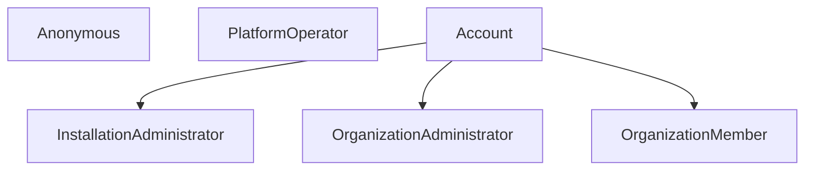

# Mycelium Forge — Roles, Permissions, and Behaviors Specification

**Applies to:** `mycelium-forge`  
**Component:** `Mycelium.Forge.Generator`, `Mycelium.Forge.Dal`, `Mycelium.Forge`  
**Related Documents:** [docs/design.md](file:///C:/RHEA/mycelium/mycelium-forge/docs/design.md), [docs/implementation-plan.md](file:///C:/RHEA/mycelium/mycelium-forge/docs/implementation-plan.md)

---

## 1. Overview

Mycelium Forge enforces access control using a **Role-Based Access Control (RBAC)** model combined with **Behavior-Driven Domain Authorization**.

- **Static Permissions & Roles:** Defined via CSV configuration files and compiled into strongly-typed enums (`PermissionKind`), role-permission mappings (`RolePermissionMap`), and service interfaces (`IPermissionService<T>`).
- **Entity Behaviors:** Specialized authorization paradigms defined in `forge-entity-behaviors.json` that govern entities with contextual ownership, hierarchical parent delegation, scope transitions, or invitation lifecycles.
- **Dual-Layer Enforcement:**
  1. **Application Layer:** Validates authorization in domain services before performing CRUD operations (`IsAllowedToCreate`, `IsAllowedToRead`, `IsAllowedToUpdate`, `IsAllowedToDelete`).
  2. **Data Access Layer (SQL Predicates):** Injects row-level security filters into PostgreSQL queries via `BuildReadFilterPredicate` to ensure callers cannot query or enumerate unauthorized records.

```
+------------------------------------+----------------------------------------+
| Definition Source                  | Generated Artifact / Implementation     |
+------------------------------------+----------------------------------------+
| forge-roles-and-permissions.csv    | PermissionKind enum, RolePermissionMap |
| forge-entity-permissions.csv       | IPermissionService<T>, PermissionGuard |
| forge-property-permissions.csv     | Property-level mutation checks         |
| forge-entity-behaviors.json        | Custom permission service methods,     |
|                                    | SQL read filter predicates             |
+------------------------------------+----------------------------------------+
```

---

## 2. Roles Reference

Roles define sets of permissions assigned to actors (users, tokens, or automated operators). Roles support single inheritance.

### 2.1 Role Hierarchy



### 2.2 System Roles Catalog

| Role | Inherits | Description | Primary Capabilities |
|---|---|---|---|
| `InstallationAdministrator` | `Account` | Super-administrator across the entire Forge deployment. | Full administrative access across all accounts, organizations, packages, and system metrics. |
| `PlatformOperator` | *None* | Infrastructure operations and SRE team. | SaaS health monitoring, metrics, and platform-wide defaults. |
| `OrganizationAdministrator` | `Account` | Tenant administrator for a specific Organization. | Manage organization profile, invite/remove members, configure publishing policies and visibility, manage org packages. |
| `OrganizationMember` | `Account` | Regular member of an Organization tenant. | View member lists, publish packages to organization scope, collaborate on organization packages. |
| `Account` | *None* | Standard authenticated user account. | Manage own profile, manage personal packages (`@username/*`), issue/revoke personal API keys, create organizations. |
| `Anonymous` | *None* | Unauthenticated visitor, crawler, or package consumer. | Read public packages, download published versions, view reference data (countries, package types). |

---

## 3. Permissions Catalog

Permissions are atomic privileges representing discrete actions. They are configured in `Mycelium.Forge.Generator/Resources/forge-roles-and-permissions.csv`.

### 3.1 Platform & Installation Permissions

- `ViewInstallationMetrics`: Access telemetry, storage usage, and system-wide installation performance metrics.
- `ConfigurePlatformDefaults`: Adjust global settings, allowed package types, profile types, and reference data.
- `SuspendOrganizations`: Administratively suspend or lock delinquent or abusive organizations.
- `DeletePackage`: Administratively delete any package across any tenant or account.
- `ErasePackageVersion`: Hard-delete/erase a specific package version (immutability override).
- `RevokeAnyApiKey`: Administratively revoke API keys belonging to any account.

### 3.2 Organization Permissions

- `ViewAllOrganizations`: Read and list all organizations in the platform (bypass membership checks).
- `ManageOrganizations`: Manage, update, or administratively configure any organization.
- `CreateOrganization`: Create a new organization tenant.
- `ManageOrganizationSettings`: Update settings, description, links, and avatar of the organization.
- `InviteOrganizationMembers`: Send invitations to prospective members or administrators.
- `RemoveOrganizationMembers`: Expel members from the organization.
- `ConfigurePublishingPolicy`: Enforce package signing, validation rules, or release workflows on the organization.
- `TransferOrganizationAdministration`: Transfer the primary administrator ownership of the organization.
- `ConfigureDefaultPackageVisibility`: Set default visibility (Public / Internal / Private) for newly published packages.
- `ViewOrganizationPackageList`: View packages belonging to the organization.
- `ViewOrganizationMemberList`: View members and their roles within the organization.
- `AcceptOrganizationInvitation`: Accept an invitation to join an organization.
- `RevokeOrganizationInvitation`: Cancel or revoke a pending invitation to an organization.

### 3.3 Package Permissions

- `PublishPackageToPersonalScope`: Publish a new package under the caller's personal namespace (`@user/pkg`).
- `PublishPackageToOrganizationScope`: Publish a new package under an organization's namespace (`@org/pkg`).
- `PublishPackageVersion`: Publish a new SemVer version for an existing package.
- `UnlistPackageVersion`: Unlist an existing package version from search results and index listings.
- `RelistPackageVersion`: Relist a previously unlisted package version.
- `SetPackageVisibility`: Change package visibility between Public, Internal, and Private.
- `ManagePackageTeam`: Add, remove, or change maintainers on a package.
- `TransferPackageOwnership`: Transfer package ownership to another account or organization.
- `ManagePackageSettings`: Modify package descriptions, metadata, README, and tags.
- `AcceptPackageInvitation`: Accept an invitation to become maintainer/owner of a package.
- `RevokePackageInvitation`: Revoke a pending package maintainer invitation.

### 3.4 Account & Personal Scope Permissions

- `ViewAllAccounts`: Query and list all user accounts across the system.
- `ManageAccounts`: Administratively edit or deactivate user accounts.
- `ManageOwnProfile`: Edit own profile, display name, bio, and associated contact info.
- `IssueApiKey`: Generate new personal API keys for CLI and CI/CD access.
- `RevokeOwnApiKey`: Revoke personal API keys.
- `ListOwnApiKeys`: List personal active and revoked API keys.
- `CreateAddress` / `ReadAddress` / `UpdateAddress` / `DeleteAddress`: Manage personal or organization postal addresses.
- `CreateProfileLink` / `ReadProfileLink` / `UpdateProfileLink` / `DeleteProfileLink`: Manage social, repository, and web links.

### 3.5 Reference Data Permissions

- `ReadCountry`: Query supported country codes and names.
- `ReadPackageType`: Query supported package types and extensions.
- `ReadProfileType`: Query supported profile link categories.

---

## 4. Entity & Property Permissions

Configured in `forge-entity-permissions.csv` and `forge-property-permissions.csv`.

### 4.1 Entity CRUD Permission Mapping

| Entity | Create Permission | Read Permission | Update Permission | Delete Permission | Owner Property | Maintainer Property | Visibility Property |
|---|---|---|---|---|---|---|---|
| `Package` | `PublishPackageToPersonalScope` | *(Handled by OrganizationScope)* | `ManagePackageSettings` | `DeletePackage` | `PackageOwner` | `PackageMaintainer` | `Visibility` |
| `Organization` | `CreateOrganization` | `ViewAllOrganizations \| ManageOrganizations` | `ManageOrganizationSettings \| ManageOrganizations` | `ManageOrganizations` | `Administrator` | `Member` | `DefaultPackageVisibility` |
| `APIKey` | `IssueApiKey` | `RevokeAnyApiKey` | `RevokeAnyApiKey` | `RevokeAnyApiKey` | `Owner` | | |
| `Account` | `ManageAccounts` | `ViewAllAccounts \| ManageAccounts` | `ManageAccounts` | `ManageAccounts` | `Id` | | |
| `OrganizationInvitation` | `InviteOrganizationMembers` | `ViewOrganizationMemberList` | | | `Owner` | | |
| `PackageInvitation` | `ManagePackageTeam` | `ManagePackageTeam` | | | `Owner` | | |
| `PackageVersion` | `PublishPackageVersion` | *(Handled by ParentDelegation)* | | `ErasePackageVersion` | | | |
| `PackageMetaData` | `PublishPackageVersion` | *(Public/Internal)* | `ManagePackageSettings` | `DeletePackage` | | | |
| `ProfileLink` | `CreateProfileLink` | `ReadProfileLink` | `UpdateProfileLink` | `DeleteProfileLink` | `Owner` | | |
| `Address` | `CreateAddress` | `ReadAddress` | `UpdateAddress` | `DeleteAddress` | `Owner` | | |
| `Country` | `ConfigurePlatformDefaults` | `ReadCountry` | `ConfigurePlatformDefaults` | `ConfigurePlatformDefaults` | | | |
| `Forge` | `ConfigurePlatformDefaults` | `ViewInstallationMetrics` | `ConfigurePlatformDefaults` | `ConfigurePlatformDefaults` | | | |
| `PackageType` | `ConfigurePlatformDefaults` | `ReadPackageType` | `ConfigurePlatformDefaults` | `ConfigurePlatformDefaults` | | | |
| `ProfileType` | `ConfigurePlatformDefaults` | `ReadProfileType` | `ConfigurePlatformDefaults` | `ConfigurePlatformDefaults` | | | |

### 4.2 Property-Level Mutation Rules

When updating an entity, specific property changes require elevated permissions beyond general entity update permissions:

| Entity | Property | Required Permission | Operation | Description |
|---|---|---|---|---|
| `Package` | `Visibility` | `SetPackageVisibility` | `Update` | Changing visibility between Public, Internal, and Private. |
| `Package` | `PackageOwner` | `ManagePackageTeam` | `Update` | Modifying the package owner set. |
| `Package` | `PackageMaintainer` | `ManagePackageTeam` | `Update` | Modifying the package maintainer set. |
| `Package` | `Owner` | `TransferPackageOwnership` | `Update` | Transferring root scope ownership of a package. |
| `Organization` | `Administrator` | `TransferOrganizationAdministration` | `Update` | Changing the primary organization administrator. |
| `Organization` | `Member` | `InviteOrganizationMembers \| ManageOrganizations` | `Update` | Modifying organization membership. |
| `Organization` | `DefaultPackageVisibility` | `ConfigureDefaultPackageVisibility \| ManageOrganizations` | `Update` | Changing tenant default package visibility. |

---

## 5. Entity Behaviors Reference

Entity Behaviors are declarative authorization patterns assigned to entities in `Mycelium.Forge.Generator/Resources/forge-entity-behaviors.json`. Each behavior generates custom constructor dependency injection, asynchronous authorization logic, and SQL read filter predicates.

All behavior keys are defined under `ConfigurationKeys` in `Mycelium.Forge.Generator.Constants`.

### 5.1 ScopeItem Behavior (`BehaviorTypes.ScopeItem`)

- **Purpose:** Entities owned by a parent Account or Organization (e.g. `Address`, `ProfileLink`).
- **Configuration Keys:** `ConfigurationKeys`
  - `ScopeEntity`: Target scope entity name (e.g., `Organization`).
  - `OwnerProperty`: Property indicating the owner (e.g., `Owner`).
  - `ReadBypassPermissions`: Array of permissions that bypass ownership checks on read (e.g., `ViewOrganizationMemberList`, `ViewAllOrganizations`, `ViewAllAccounts`).
  - `PersonalManagePermission`: Permission required when managing personal items (`ManageOwnProfile`).
  - `PlatformManagePermission`: Permission bypassing organization management (`ManageOrganizations`).
  - `OrgManagePermission`: Permission required to manage organization items (`ManageOrganizationSettings`).
- **Enforcement Logic:**
  - Delegates management to `ScopeItemPermissionHelper.IsAllowedToManageScopeItem(userContext, ownerId, scopeService, entityName)`.
  - Reading delegates to `ScopeItemPermissionHelper.IsAllowedToReadScopeItem(userContext, ownerId, scopeService)`.
- **SQL Read Filter:**
  Generates an SQL predicate verifying whether the caller is the owner or a member/administrator of the owning organization:
  ```sql
  @canViewOrganizationMemberList = true OR @canViewAllOrganizations = true OR @canViewAllAccounts = true
  OR (@callerAccountId IS NOT NULL AND (
      "Address"."owner" = @callerAccountId
      OR EXISTS (SELECT 1 FROM "Forge"."Organization_member__Account" WHERE "sourceOrganization" = "Address"."owner" AND "targetAccount" = @callerAccountId)
      OR EXISTS (SELECT 1 FROM "Forge"."Organization_administrator__Account" WHERE "sourceOrganization" = "Address"."owner" AND "targetAccount" = @callerAccountId)
  ))
  ```

---

### 5.2 ParentDelegation Behavior (`BehaviorTypes.ParentDelegation`)

- **Purpose:** Sub-entities whose permissions and state transitions delegate entirely to a parent entity's access rules (e.g., `PackageVersion` governed by `Package`).
- **Configuration Keys:** `ConfigurationKeys`
  - `ParentEntity`: Name of parent entity (e.g., `Package`).
  - `ParentKey`: Foreign key property pointing to parent (e.g., `Owner`).
  - `ParentOwnerProperties`: Comma-separated list or array of parent properties representing ownership (e.g., `PackageOwner,PackageMaintainer`).
  - `CreatePermission`: Permission required to create a child instance (e.g., `PublishPackageVersion`).
  - `DeletePermission`: Permission required to delete a child instance (e.g., `ErasePackageVersion`).
  - `StateProperty`: Mutable state flag on child entity (e.g., `Listed`).
  - `StateActivePermission`: Permission required to activate state (e.g., `RelistPackageVersion`).
  - `StateInactivePermission`: Permission required to deactivate state (e.g., `UnlistPackageVersion`).
- **Enforcement Logic:**
  - Loads the parent entity via `IParentService` and invokes `IParentPermissionService.IsAllowedToRead(...)`.
  - State changes (such as listing/unlisting) verify `StateActivePermission` or `StateInactivePermission` against the parent maintainer list.
- **SQL Read Filter:**
  Inherits and joins the SQL read filter predicate of the parent entity using the foreign key column (`"parentkey" = "ParentEntity"."id"`).

---

### 5.3 OrganizationScope Behavior (`BehaviorTypes.OrganizationScope`)

- **Purpose:** Entities that can be created in either personal scope (`@username`) or organization scope (`@organization`), with visibility levels (`Public`, `Internal`, `Private`) (e.g., `Package`).
- **Configuration Keys:** `ConfigurationKeys`
  - `ScopeEntity`: Scope container entity name (e.g., `Organization`).
  - `PersonalCreatePermission`: Permission required for personal scope creation (`PublishPackageToPersonalScope`).
  - `OrgCreatePermission`: Permission required for organization scope creation (`PublishPackageToOrganizationScope`).
  - `VisibilityProperty`: Property name storing visibility (e.g., `Visibility`).
  - `OwnerProperty`: Property name referencing the owning scope (`Owner`).
  - `ScopeMemberProperties`: Properties on organization entity representing membership (`Member,Administrator`).
  - `BypassPermissions`: Permissions that bypass tenant checks for internal items (`ViewAllOrganizations,ManageOrganizations`).
- **Enforcement Logic:**
  - **Create:** Checks whether target scope is an account (requires `PersonalCreatePermission`) or organization (requires `OrgCreatePermission` + caller is an organization member).
  - **Read:**
    - `Public`: Allowed for any user (including Anonymous).
    - `Internal`: Allowed for members/administrators of the owning organization, or callers with `BypassPermissions`.
    - `Private`: Allowed only for explicit package owners and maintainers.
- **SQL Read Filter:**
  Produces optimized conditional SQL filtering based on caller identity, organization membership, and package visibility:
  ```sql
  "Package"."visibility" = 0 -- Public
  OR (@callerAccountId IS NOT NULL AND (
      "Package"."owner" = @callerAccountId -- Personal scope owner
      OR (@canViewAllOrganizations = true OR @canManageOrganizations = true)
      OR EXISTS (SELECT 1 FROM "Forge"."Organization_member__Account" WHERE "sourceOrganization" = "Package"."owner" AND "targetAccount" = @callerAccountId)
  ))
  ```

---

### 5.4 InvitationWorkflow Behavior (`BehaviorTypes.InvitationWorkflow`)

- **Purpose:** Entities managing an invitation lifecycle (e.g., `OrganizationInvitation`, `PackageInvitation`).
- **Configuration Keys:** `ConfigurationKeys`
  - `ScopeEntity`: Scope entity the user is invited to (`Organization` or `Package`).
  - `ScopeProperty`: Property referencing the target scope on the invitation (`Scope` or defaults to `ScopeEntity`).
  - `ScopeRoles`: Roles on the scope entity that have authority to issue/revoke invitations (`Administrator`, `PackageOwner`, `PackageMaintainer`).
  - `InviteeProperty`: Property holding the target invited account (`Target`).
  - `OwnerProperty`: Property holding the invitation sender/creator (`Owner`).
  - `CreatePermission`: Permission required to send invitation (`InviteOrganizationMembers` / `ManagePackageTeam`).
  - `ReadPermission`: Permission required to view invitations (`ViewOrganizationMemberList` / `ManagePackageTeam`).
  - `AcceptPermission`: Permission required to accept (`AcceptOrganizationInvitation` / `AcceptPackageInvitation`).
  - `RevokePermission`: Permission required to revoke (`RevokeOrganizationInvitation` / `RevokePackageInvitation`).
  - `AdminPermission`: Administrative override permission (`ManageOrganizations` / `ManagePackageTeam`).
  - `BypassPermissions`: Permissions that bypass read filtering.
- **Enforcement Logic:**
  - **Accept:** Permitted only if the caller's Account ID matches the invitation's `InviteeProperty` (`Target`).
  - **Revoke:** Permitted if the caller is the invitation creator, an administrator/maintainer of the scope entity, or has `AdminPermission`.
  - **Read:** Permitted for the invitee, the invitation creator, and scope administrators.

---

## 6. Developer Instructions

### 6.1 How to Add a New System Role

1. Open `Mycelium.Forge.Generator/Resources/forge-roles-and-permissions.csv`.
2. Add a new row:
   ```csv
   RoleName,InheritedRole,Summary,Permission1,Permission2,...
   ```
   - Specify `InheritedRole` (e.g. `Account`) or leave blank if root.
   - Mark an `X` under every granted permission column.
3. Build `Mycelium.Forge.Generator` and run code generation:
   ```powershell
   dotnet build Mycelium.Forge.Generator
   ```

### 6.2 How to Add a New Permission

1. Open `Mycelium.Forge.Generator/Resources/forge-roles-and-permissions.csv`.
2. Add the new permission column name to the header line.
3. Mark `X` in each role row that should have this permission.
4. If this permission controls an Entity CRUD operation, update `forge-entity-permissions.csv`.
5. If this permission guards a specific property change, update `forge-property-permissions.csv`.
6. Run the generator to update `PermissionKind.cs` and `RolePermissionMap.cs`.

### 6.3 How to Configure a Behavior for an Entity

1. Open `Mycelium.Forge.Generator/Resources/forge-entity-behaviors.json`.
2. Add a configuration entry for the entity:
   ```json
   {
     "entity": "MyNewEntity",
     "behaviorType": "ScopeItem",
     "configuration": {
       "ScopeEntity": "Organization",
       "OwnerProperty": "Owner",
       "ReadBypassPermissions": [
         "ViewOrganizationMemberList",
         "ViewAllOrganizations"
       ]
     }
   }
   ```
3. Ensure the configuration matches the schema defined in `forge-entity-behaviors.schema.json`.
4. In code, refer to keys via `ConfigurationKeys.{KeyName}` (e.g., `ConfigurationKeys.ScopeEntity`).
5. Run the generator. The custom permission service and SQL filters will be generated automatically into `Mycelium.Forge.Dal/AutoGenPermissionService`.

### 6.4 How to Check Permissions in Application Code

#### In Domain Services
Auto-generated services automatically enforce permissions via the injected `IPermissionService<T>`:
```csharp
var permissionResult = await this.permissionService.IsAllowedToCreate(userContext, dto);

if (permissionResult.IsFailed)
{
    return permissionResult;
}
```

#### In Razor Pages and ViewModels
Inject `IUserContext` to perform client-side authorization checks:
```csharp
if (PermissionGuard.HasPermission(userContext, PermissionKind.PublishPackageToOrganizationScope))
{
    // Render publish button or allow navigation
}
```
